# OpenMath

<p align="center">
  
</p>

<p align="center">
  <strong>A production-ready, full-stack math quiz platform for kids, parents, and teachers.</strong><br/>
  Built with Angular + FastAPI + PostgreSQL. Dockerized. Self-hostable.<br/>
  <em>Current release: v3.2 — First Production Release</em>
</p>

---

## What is OpenMath?

OpenMath is a child-friendly quiz platform that helps kids improve both **correctness and speed** in math — starting with multiplication and expanding into a broader quiz system. It supports multiple quiz types, adaptive difficulty, student profiles, badges, KaTeX-rendered math, localization, and full session history with performance analytics.

The goal is simple: **get the highest score in the least amount of time**.

I learned full-stack application development building this project — from database design and API development to frontend frameworks, Docker, CI/CD, and production operations. I will continue to leverage these learnings in both my private life and professionally at work. I am very excited to use this math platform with my children's schoolmates, teachers, and parents — whether in person or self-hosted online.

---

## v3.2 — First Production Release Highlights

This is the first production-ready release of OpenMath. The focus was to get a **production-grade full-stack application** end-to-end: Dockerized, database-backed, with authentication, role-based access control, localization, badges, KaTeX rendering, and a complete DevOps CLI.

### Start a Quiz

Choose quiz type, difficulty, learned timetables, and question count. KaTeX renders math beautifully.

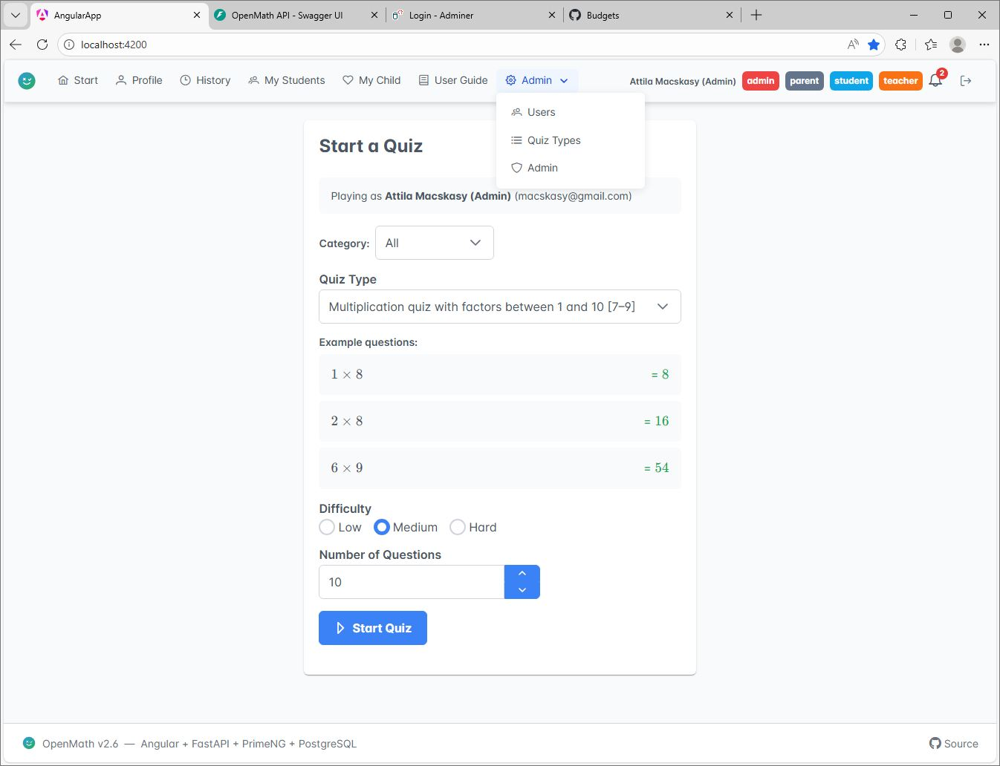

### Session Detail & Review

Review each question with correct/wrong status, your answer vs. the expected answer, and session summary metrics.

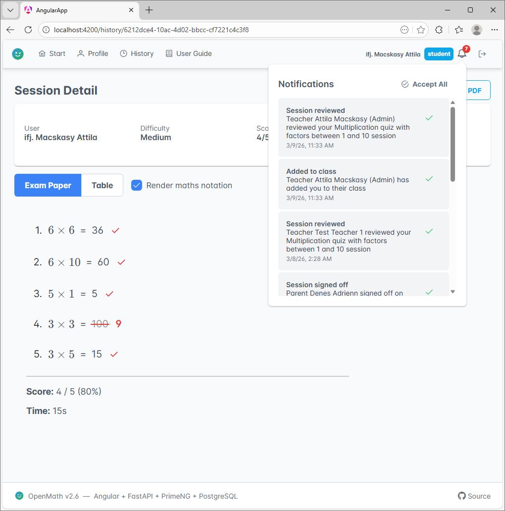

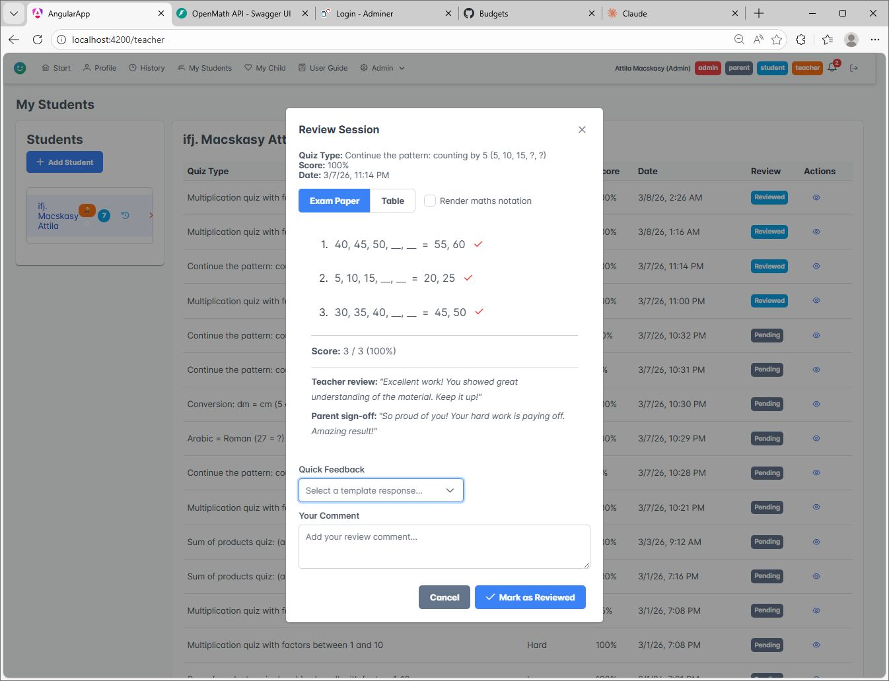

### User Profiles with Badges & Performance

Earned badges are displayed on the profile. Performance stats are aggregated by quiz type with time tracking.

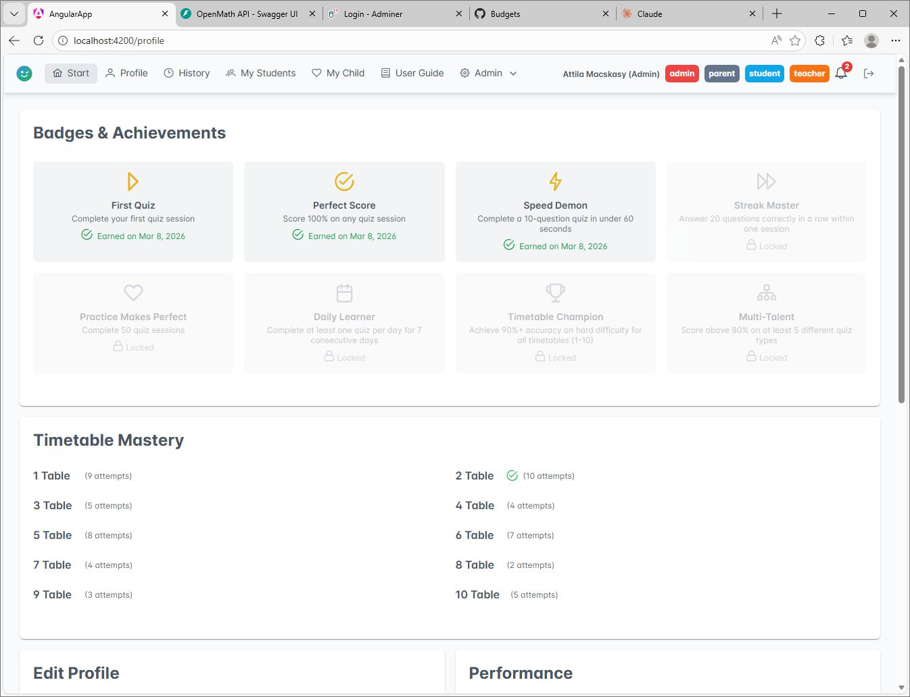

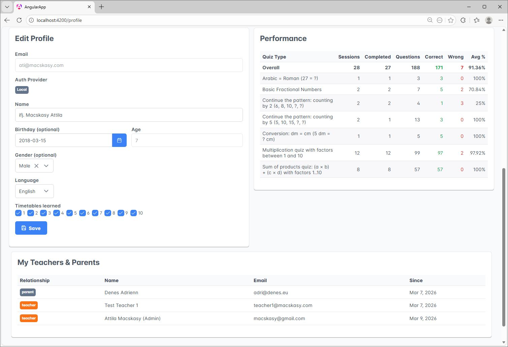

### User Management

Manage users with role-based access control (Admin, Teacher, Student, Parent).

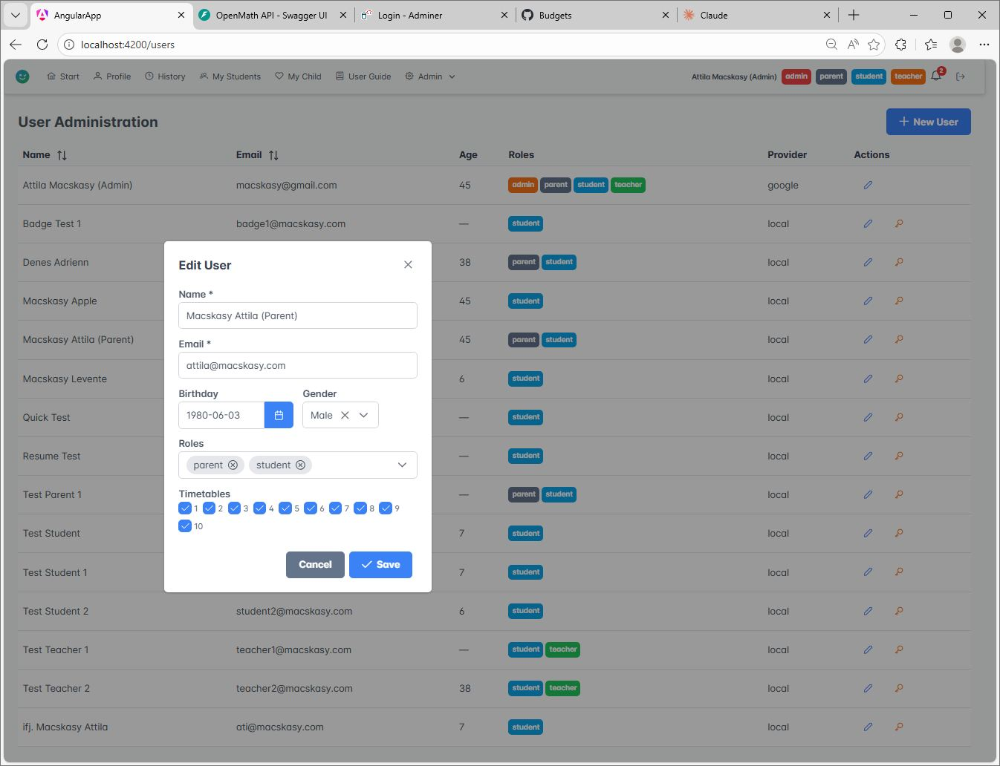

### Admin Panel & Quiz Type Management

Database statistics, table browser, danger zone reset, and quiz type configuration.

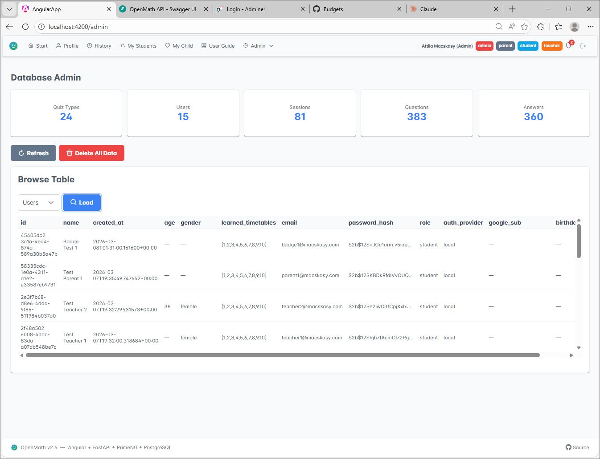

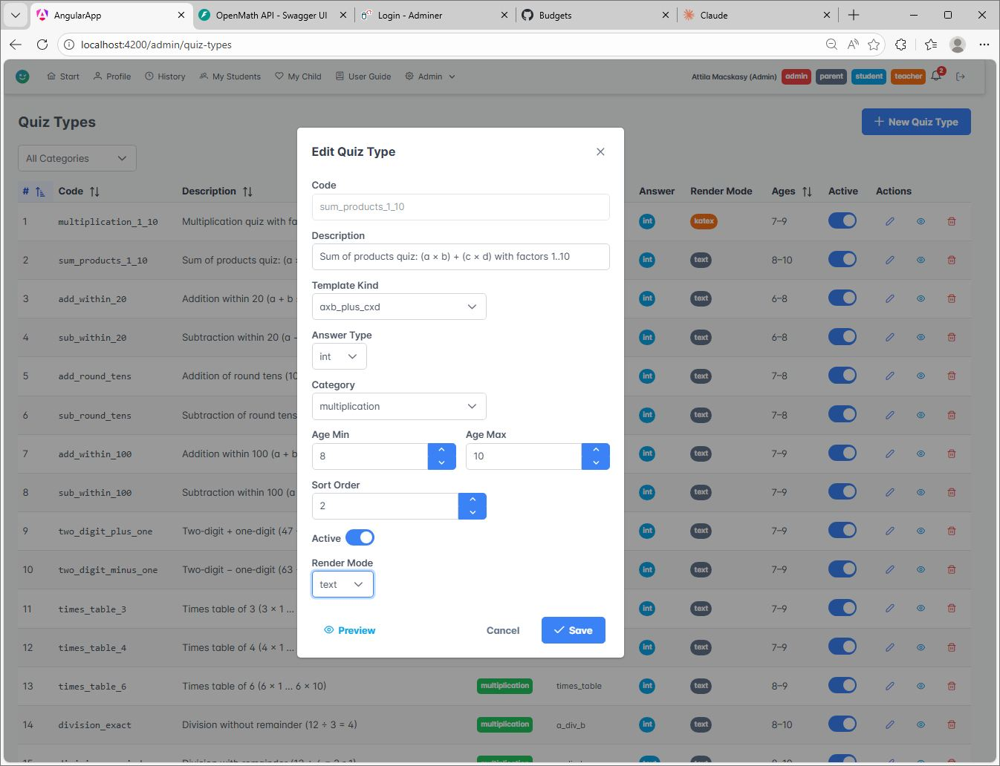

### Backend — FastAPI with Swagger UI

Clean, well-typed API with auto-generated interactive documentation.

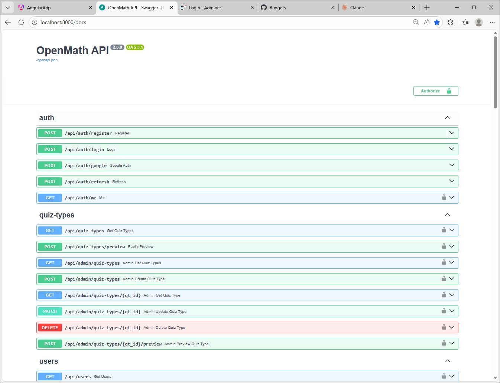

### DevOps CLI & Production Tooling

A powerful Python-based CLI (`dev.py`) manages the entire development and production lifecycle.

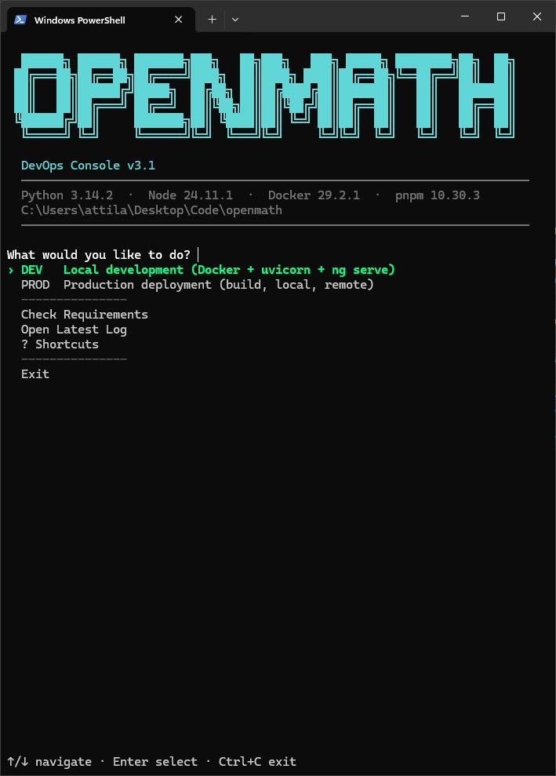

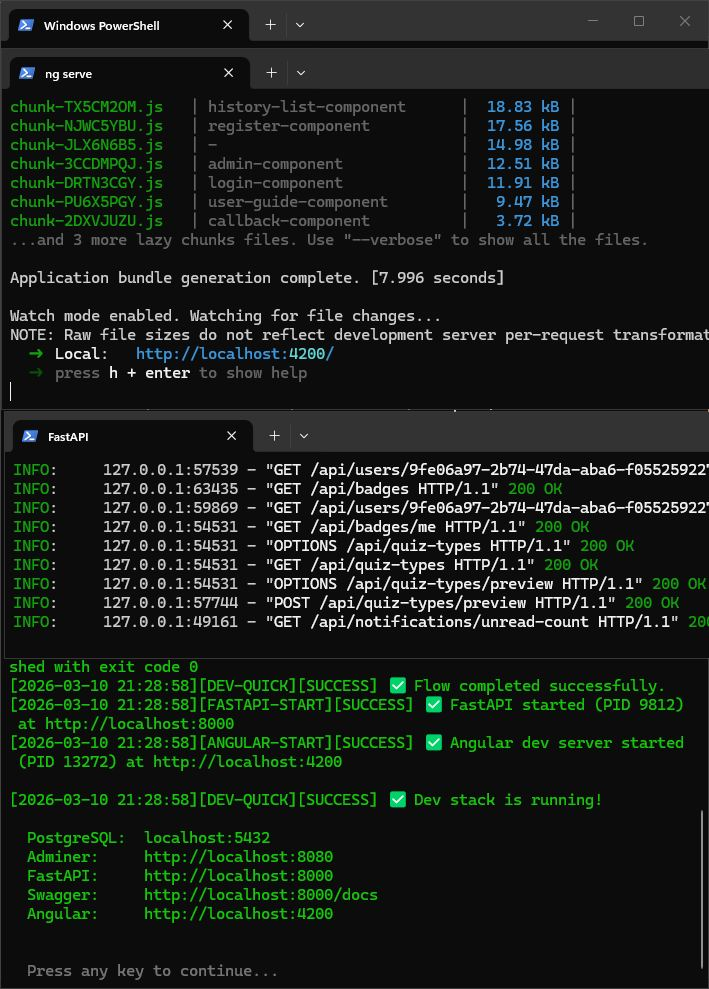

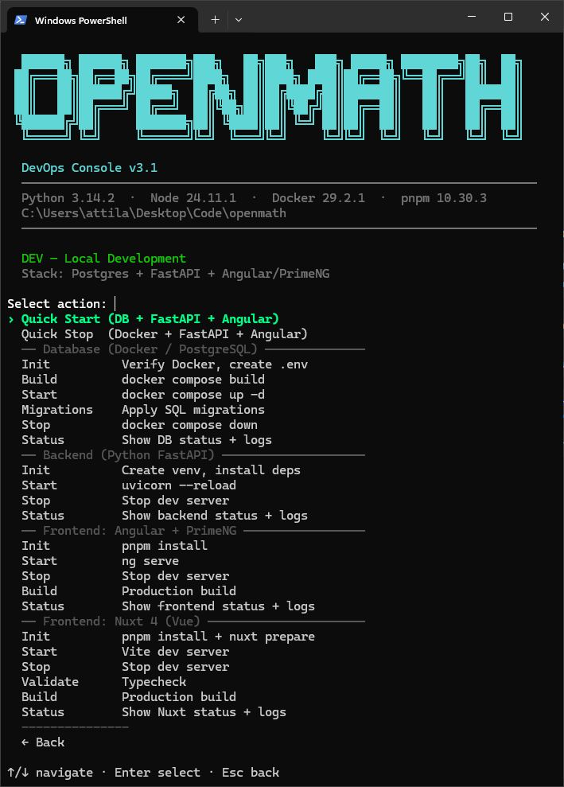

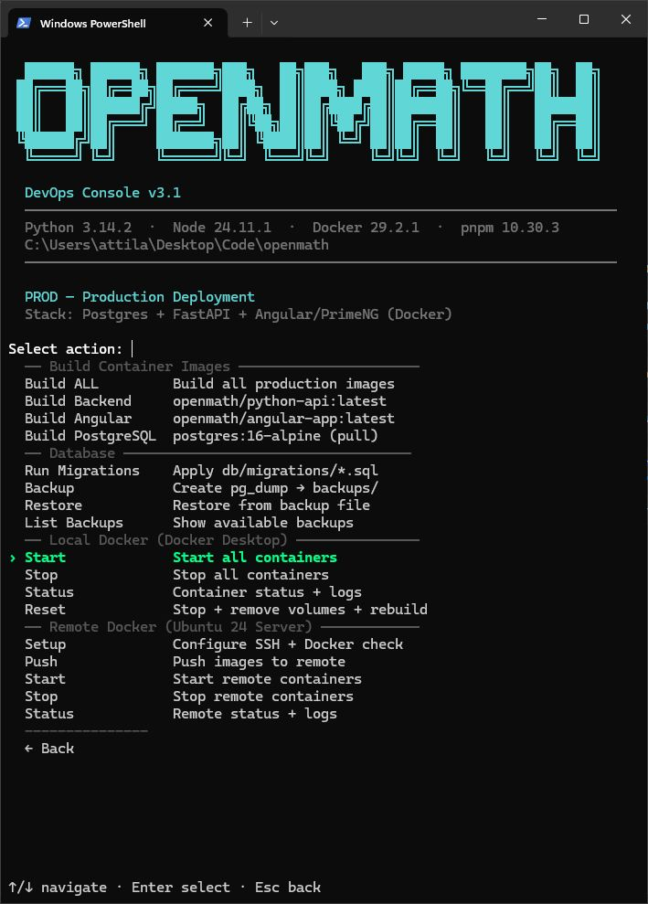

---

## Tech Stack

| Layer | Technology |
|---|---|
| **Frontend (primary)** | Angular 18 + PrimeNG 17 (Lara Light Blue theme) |
| **Frontend (maintained)** | Nuxt 4 + Vue 3 (Reka UI) |
| **Frontend (planned)** | SvelteKit + Svelte 5 |
| **Backend** | Python FastAPI + asyncpg + Uvicorn |
| **Database** | PostgreSQL 16 with JSONB + GIN indexes |
| **Auth** | Google SSO + JWT + Role-Based Access Control |
| **Rendering** | KaTeX for math equations |
| **Localization** | i18n (Hungarian + English) |
| **DevOps** | Docker Compose, Nginx reverse proxy, Python CLI |
| **Monitoring** | OpenTelemetry (planned — v3.3) |

**PostgreSQL is amazing.** JSONB columns with GIN indexes give you the flexibility of a document store with the power of a relational database. It has been rock solid throughout this project.

I am still committed to maintaining both the **VueJS/Nuxt** and the upcoming **Svelte** frontends. The **FastAPI** backend stays — it is clean, fast, and a joy to work with.

---

## How We Built This

The combination of **GitHub Copilot** and **Claude Code** is amazing. With strong domain knowledge, senior human mentors (full-stack developers), thorough code reviews, and dedicated testers, everything is possible **in days** — not weeks, not months, not years like before.

Senior mentors (human full-stack developers) and AI together achieved what would have previously taken an entire team months. OTEL and production monitoring (v3.3) is still ahead, but we achieved a tremendous amount here already.

---

## Roadmap & Vision

OpenMath started as a math quiz app for my sons Attila and Levente. It became
something bigger — a deliberate engineering laboratory where I build, break,
and rebuild every layer of a modern production system on my own infrastructure.

I have 28 years in IT. I work as a Multi-Cloud Architect inside a large
enterprise, designing infrastructure that serves millions of users. But there
is a gap between *advising on* systems and *owning* them end-to-end. OpenMath
closes that gap. I treat it the way an enterprise treats a production
application — proper environments (DEV, UAT, PROD), CI/CD pipelines,
observability, security hardening, and infrastructure-as-code — all self-hosted
on hardware I own, running open-source tools that mirror what the cloud
services abstract away.

Eight roadmap documents define the path forward:

| # | Roadmap | What it covers |
|---|---|---|
| 1 | [Application Gateway](docs/roadmap_application_gateway_publish.md) | Traefik reverse proxy, HTTPS with Let's Encrypt, multi-domain routing |
| 2 | [Automated Testing](docs/roadmap_automated_testing.md) | pytest, Playwright, Grafana k6 load testing across 40+ endpoints |
| 3 | [DevOps & CI/CD](docs/roadmap_devops.md) | Self-hosted GitLab CE, container registry, pipeline-as-code |
| 4 | [Observability](docs/roadmap_observability_otel_monitoring.md) | OpenTelemetry, Prometheus, Grafana, Loki — real-time dashboards |
| 5 | [Security](docs/roadmap_security.md) | SAST/DAST, HashiCorp Vault, Wazuh SIEM, container hardening |
| 6 | [Data & AI](docs/roadmap_data_and_ai.md) | Learning analytics, DuckDB OLAP, scikit-learn ML models |
| 7 | [On-Premises AI](docs/roadmap_onpremises_nvidia_ai_ollama.md) | 2× RTX 3090 GPU server, Ollama, Qwen2.5 72B, RAG with pgvector |
| 8 | [Kubernetes & Helm](docs/roadmap_kubernetes_helm.md) | Multi-node kubeadm on Proxmox, Calico, Longhorn, Helm releases |

**[Read the full roadmap & vision →](docs/roadmap.md)**

---

## Documentation

All specifications and implementation summaries are in the `docs/` folder. Specs were written first, then implemented and documented — this table shows them side by side in development order.

### Specifications & Implementations

| Version | Specification | Implementation Summary |
|---|---|---|
| v1.0 | [spec_python_quiz.md](docs/spec_python_quiz.md) | — (initial Python CLI) |
| v1.5 | [spec_nuxt4_drizzle_reka.md](docs/spec_nuxt4_drizzle_reka.md) | — (Nuxt full-stack) |
| v2.0 | [spec_angular_fastapi_primeng.md](docs/spec_angular_fastapi_primeng.md) | [angular_fastapi_implementation.md](docs/angular_fastapi_implementation.md) |
| v2.1 | [spec_v2.1_auth_rbac.md](docs/spec_v2.1_auth_rbac.md) | [implementation_summary_v2.1_auth_rbac.md](docs/implementation_summary_v2.1_auth_rbac.md) |
| v2.2 | [spec_v2.2_quiz_type_editor.md](docs/spec_v2.2_quiz_type_editor.md) | — (included in v2.3) |
| v2.2.1 | [spec_v2.2.1_rename_students_to_users.md](docs/spec_v2.2.1_rename_students_to_users.md) | — (refactoring) |
| v2.3 | [spec_v2.3_advanced_rbac.md](docs/spec_v2.3_advanced_rbac.md) | [implementation_summary_v2.3_advanced_rbac.md](docs/implementation_summary_v2.3_advanced_rbac.md) |
| v2.4 | [spec_v2.4_ux_improvements.md](docs/spec_v2.4_ux_improvements.md) | [implementation_summary_v2.4_ux_improvements.md](docs/implementation_summary_v2.4_ux_improvements.md) |
| v2.5 | [spec_v2.5_notifications_and_polish.md](docs/spec_v2.5_notifications_and_polish.md) | [implementation_summary_v2.5_notifications_and_polish.md](docs/implementation_summary_v2.5_notifications_and_polish.md) |
| v2.6 | [spec_v2.6_localization.md](docs/spec_v2.6_localization.md) | [implementation_summary_v2.6_localization.md](docs/implementation_summary_v2.6_localization.md) |
| v2.7 | [spec_v2.7_incentive_badge_system.md](docs/spec_v2.7_incentive_badge_system.md) | [implementation_summary_v2.7_badges_pdf.md](docs/implementation_summary_v2.7_badges_pdf.md) |
| v2.7.5 | [spec_v2.7.5_katex_rendering.md](docs/spec_v2.7.5_katex_rendering.md) | [implementation_summary_v2.7.5_katex_rendering.md](docs/implementation_summary_v2.7.5_katex_rendering.md) |
| v2.8 | [spec_v2.8_production_dockerization.md](docs/spec_v2.8_production_dockerization.md) | [implementation_summary_v2.8_production_dockerization.md](docs/implementation_summary_v2.8_production_dockerization.md) |
| v3.0 | [spec_v3.0_devops_script.md](docs/spec_v3.0_devops_script.md) | — (DevOps CLI) |
| v3.1 | [spec_v3.1_cli_redesign.md](docs/spec_v3.1_cli_redesign.md) | — (CLI redesign) |
| v3.2 | [spec_v3.2_database_backup_restore.md](docs/spec_v3.2_database_backup_restore.md) | — (DB backup/restore) |
| v3.3 | [spec_v3.3_otel_monitoring.md](docs/spec_v3.3_otel_monitoring.md) | *planned — not yet implemented* |

### Architecture & Stack Exploration

| Document | Description |
|---|---|
| [spec_python_fullstack_frontends.md](docs/spec_python_fullstack_frontends.md) | Full-stack architecture with Python backend and multiple frontends |
| [spec_react_fastapi.md](docs/spec_react_fastapi.md) | React + FastAPI stack exploration |
| [spec_react_laravel_chakra.md](docs/spec_react_laravel_chakra.md) | React + Laravel stack (replaced by Angular + FastAPI) |
| [spec_svelte_fastapi.md](docs/spec_svelte_fastapi.md) | Svelte + FastAPI stack (planned) |
| [multiproject_repo_spec.md](docs/multiproject_repo_spec.md) | Monorepo strategy and shared DB guidance |
| [tech_stack_and_folder_structure.md](docs/tech_stack_and_folder_structure.md) | Tech stack overview and folder layout |

### Guides & References

| Document | Description |
|---|---|
| [production_operations_guide.md](docs/production_operations_guide.md) | Production deployment and operations |
| [google_sso_config_guide.md](docs/google_sso_config_guide.md) | Google SSO configuration |
| [frontend_ui_ecosystem_guide.md](docs/frontend_ui_ecosystem_guide.md) | Frontend UI framework comparison |
| [dev_ps1_nuxt4_step_by_step.md](docs/dev_ps1_nuxt4_step_by_step.md) | Dev assistant step-by-step for Nuxt |
| [spec_win11_dev_assistant_nuxt4.md](docs/spec_win11_dev_assistant_nuxt4.md) | Win11 dev assistant spec |
| [source_context_v2.md](docs/source_context_v2.md) | Source context for AI assistants |

### AI & Model Notes

| Document | Description |
|---|---|
| [claude_code_lessons.md](docs/claude_code_lessons.md) | Lessons learned using Claude Code |
| [model_recommendation_claude_opus_4.6.md](docs/model_recommendation_claude_opus_4.6.md) | Claude Opus 4.6 recommendation |
| [model_recommendation_chatgpt5.3.md](docs/model_recommendation_chatgpt5.3.md) | ChatGPT 5.3 recommendation |
| [model_recommendations_compared.md](docs/model_recommendations_compared.md) | AI model comparison |

---

## Quick Start

### Production (Docker Compose)

```powershell
cd c:\Users\attila\Desktop\Code\openmath
python dev.py          # Launch the DevOps CLI
# Select: Production → Up
```

### Development

```powershell
cd c:\Users\attila\Desktop\Code\openmath
python dev.py          # Launch the DevOps CLI
# Select: Development → Start API / Start Angular
```

### Nuxt Frontend (alternative)

```powershell
cd c:\Users\attila\Desktop\Code\openmath\nuxt-app
pnpm install
pnpm dev
```

### Python CLI

```powershell
cd c:\Users\attila\Desktop\Code\openmath\python-app
python src/main.py
```

---

## Repository Structure

```
openmath/
├── angular-app/       # Angular 18 + PrimeNG frontend
├── python-api/        # FastAPI backend
├── nuxt-app/          # Nuxt 4 + Vue 3 frontend (maintained)
├── python-app/        # Python CLI quiz app
├── db/                # Shared PostgreSQL migrations & seeds
├── devops/            # DevOps CLI (dev.py)
├── docs/              # All specs and implementation summaries
├── assets/images/     # Screenshots by version
├── docker-compose.yml         # Development stack
├── docker-compose.prod.yml    # Production stack
├── dev.py             # DevOps CLI entry point
└── dev.ps1            # Legacy PowerShell dev assistant
```

All implementations share the same PostgreSQL database schema via canonical SQL migrations in `db/migrations/`.

---

## Previous Release Screenshots

<details>
<summary><strong>v2.0 — Angular + FastAPI + PrimeNG</strong></summary>

Of all the implementations in this repository, **v2.0 was the first polished web release**. The Angular + PrimeNG combination produces a clean, professional UI — the Lara Light Blue theme, fluid PrimeFlex layouts, and reactive signal-based state give it a coherence the other stacks don't match visually. FastAPI with asyncpg is rock solid on the backend.

#### Frontend

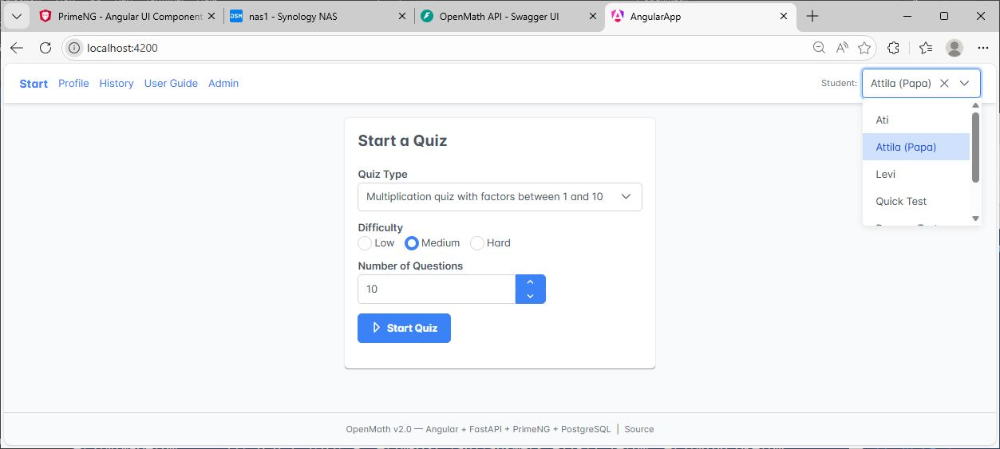
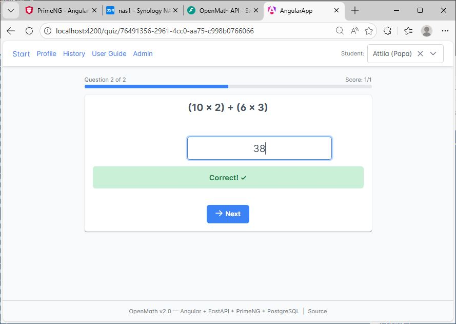
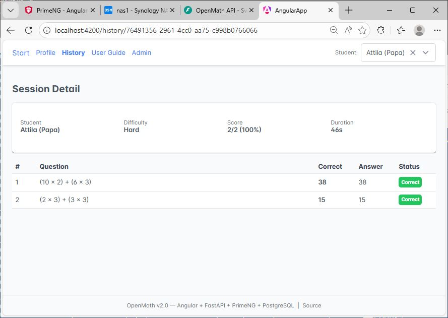
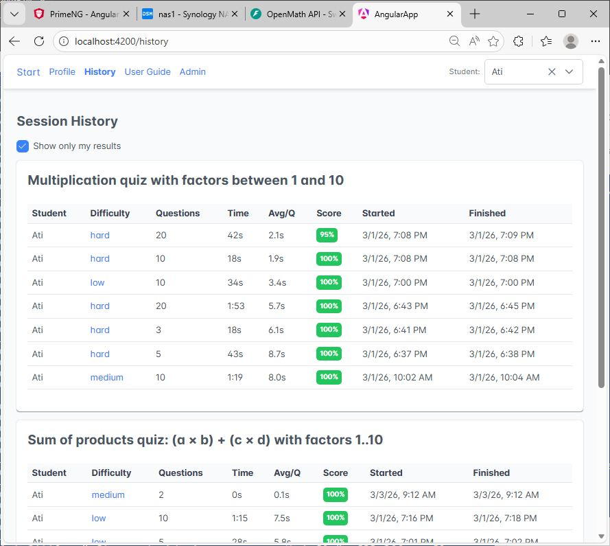
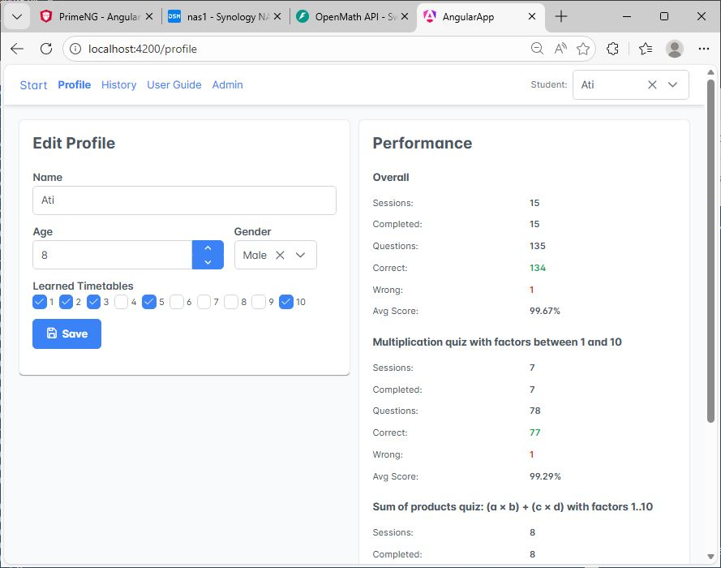
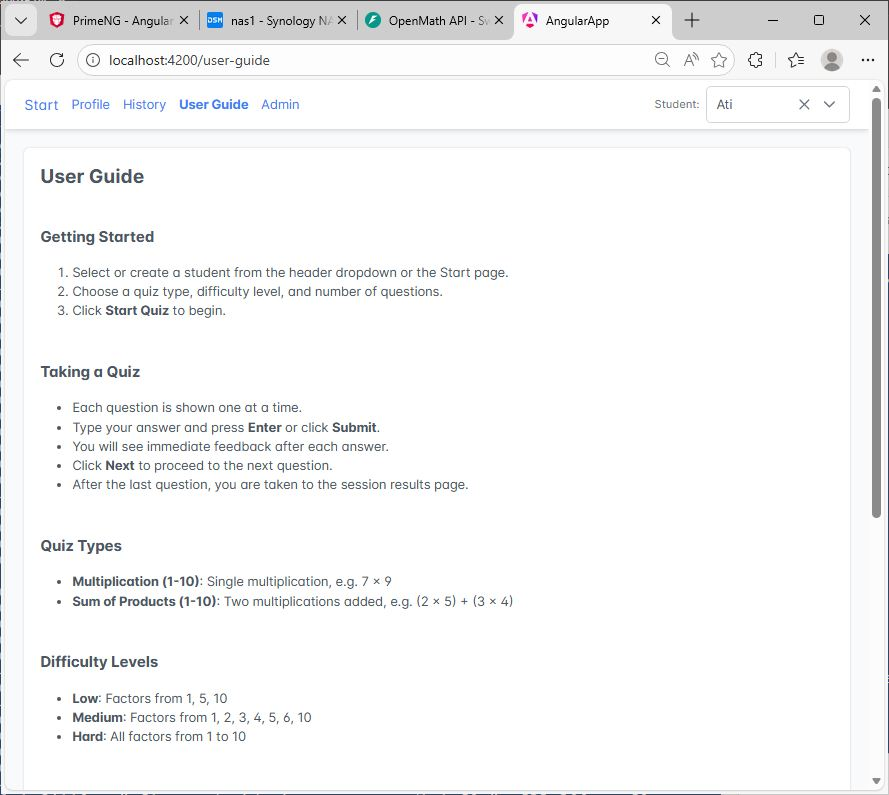
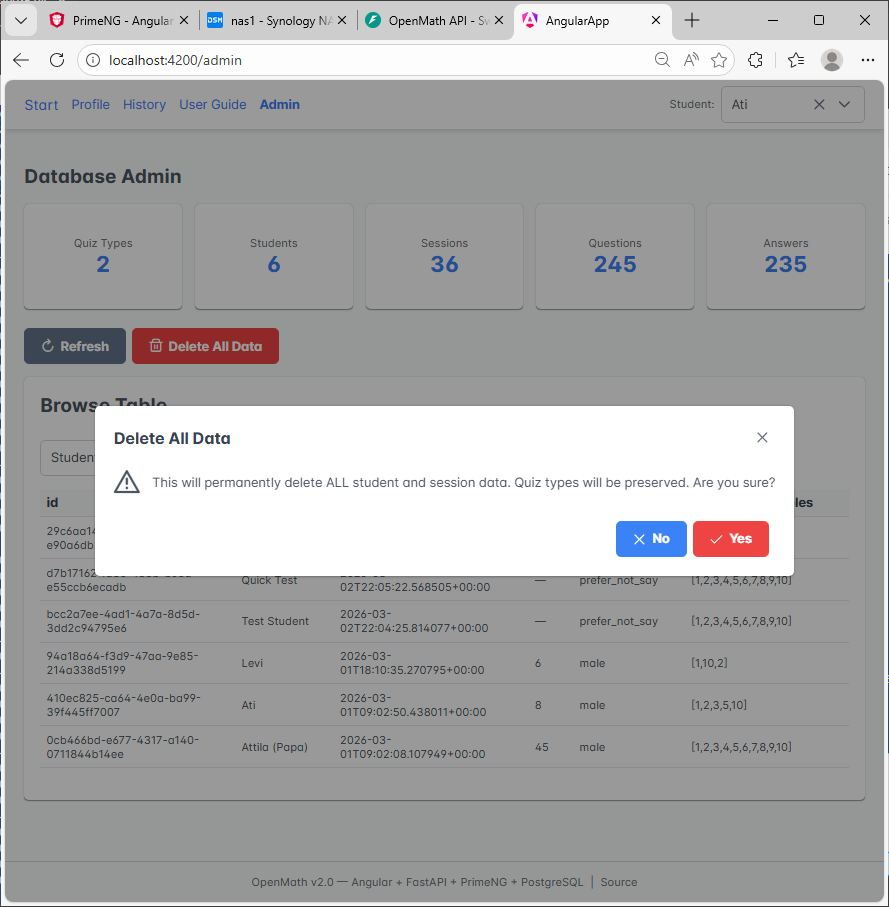

#### Backend & Database

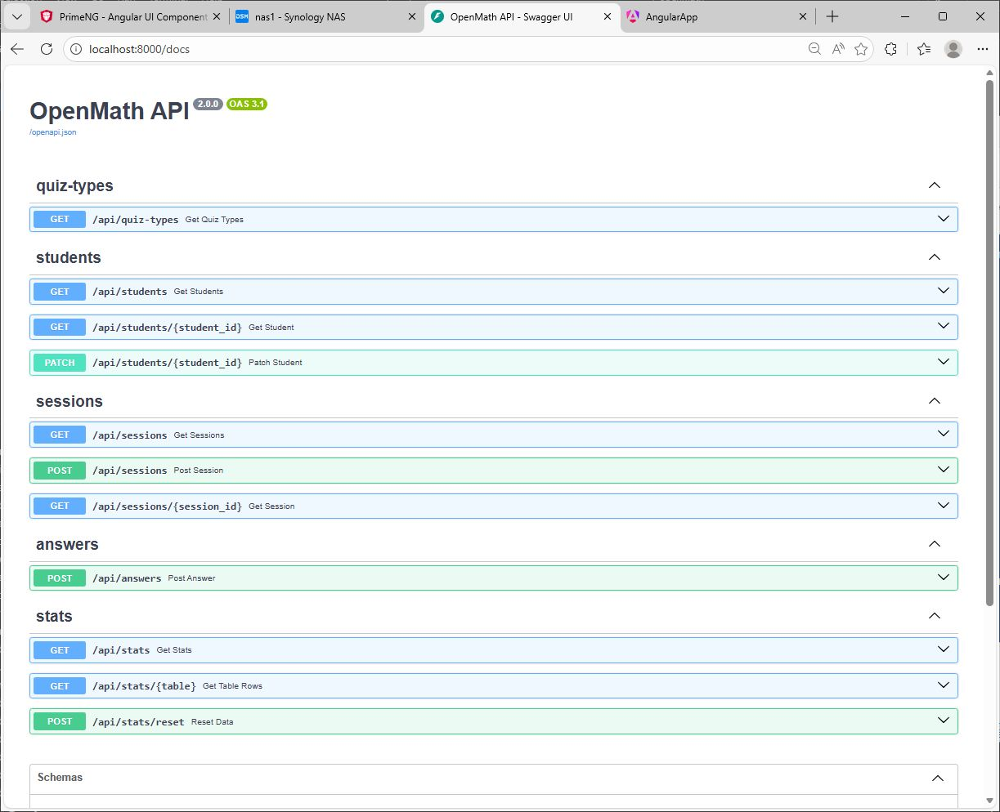
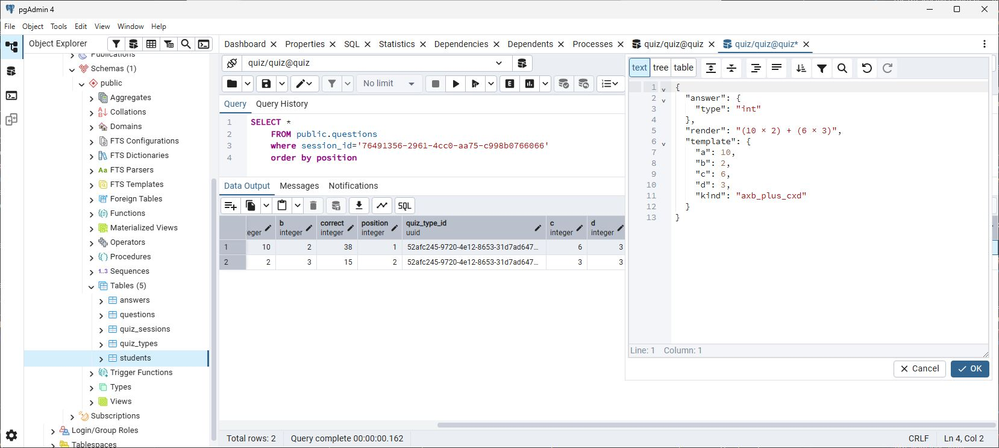
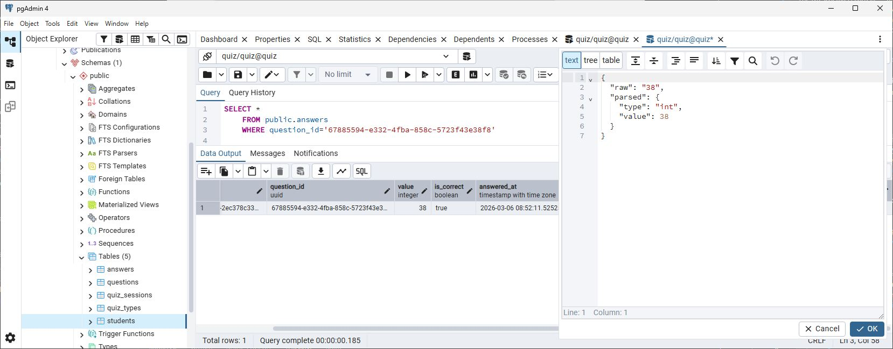

#### Dev Tooling

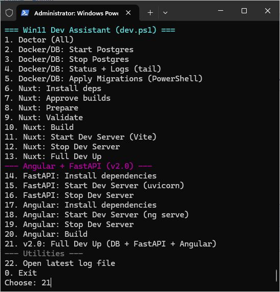
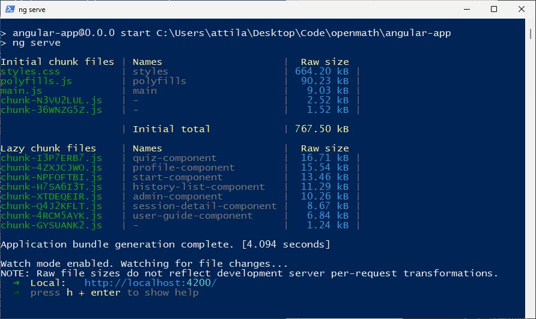
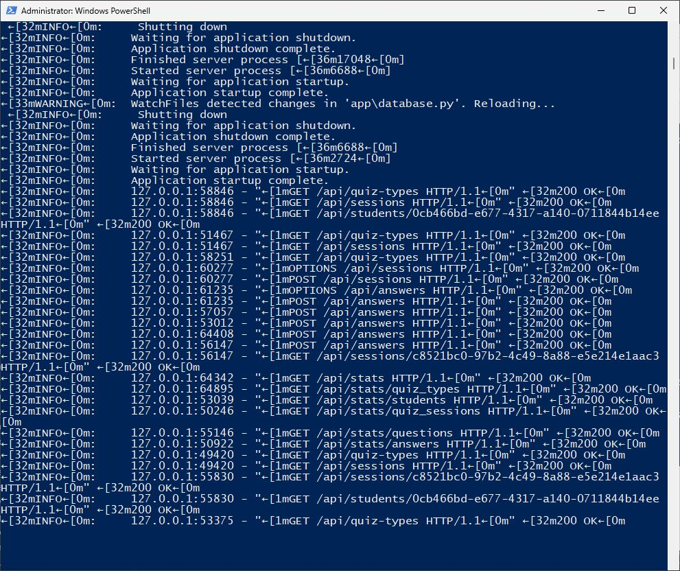

</details>

<details>
<summary><strong>v1.5 — Nuxt + Nitro + Drizzle</strong></summary>


</details>

<details>
<summary><strong>v1.5 — Python CLI</strong></summary>

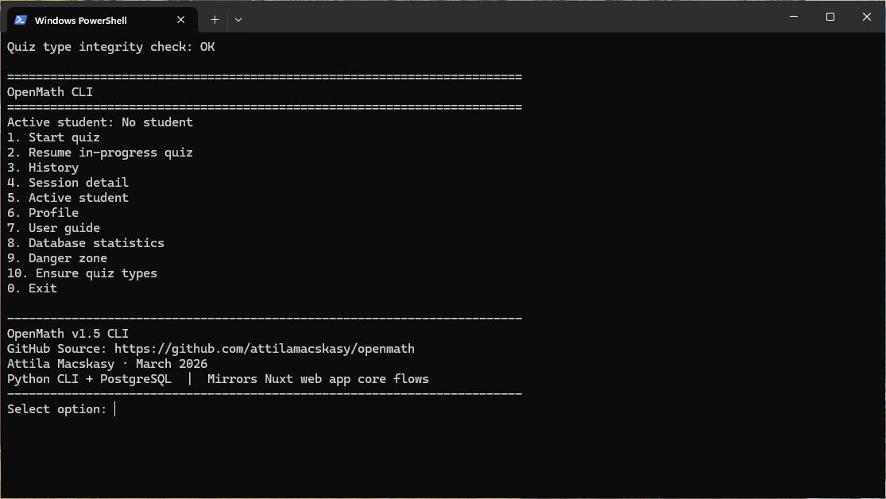
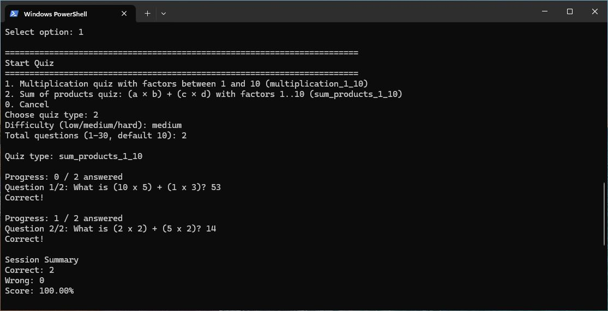
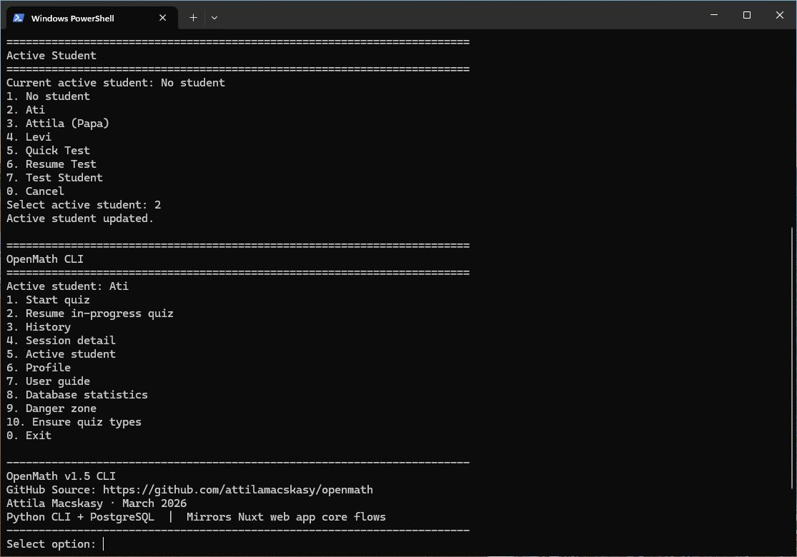
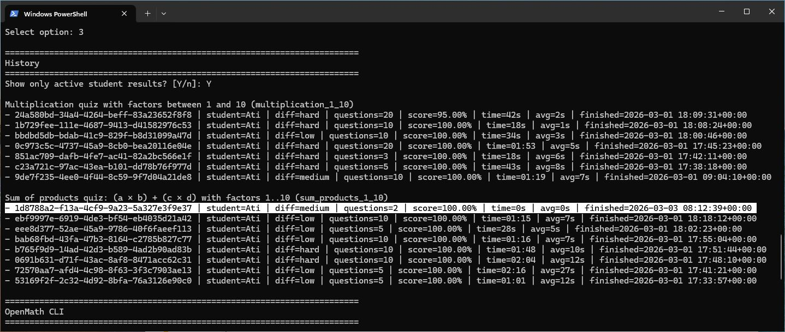
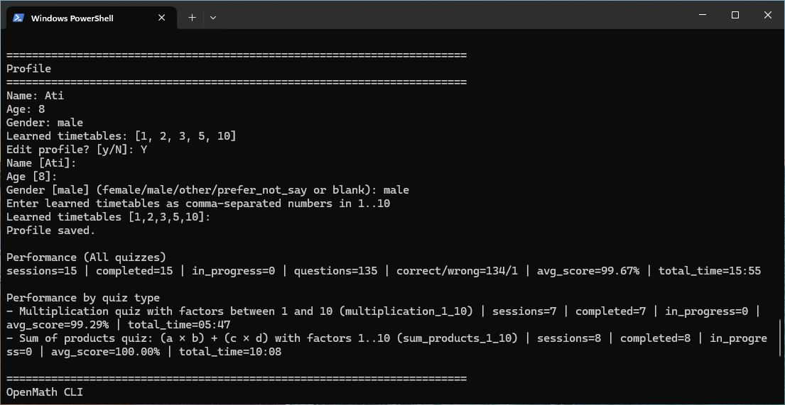

</details>

---

## License

This project is licensed under the **MIT License**. See `LICENSE`.
