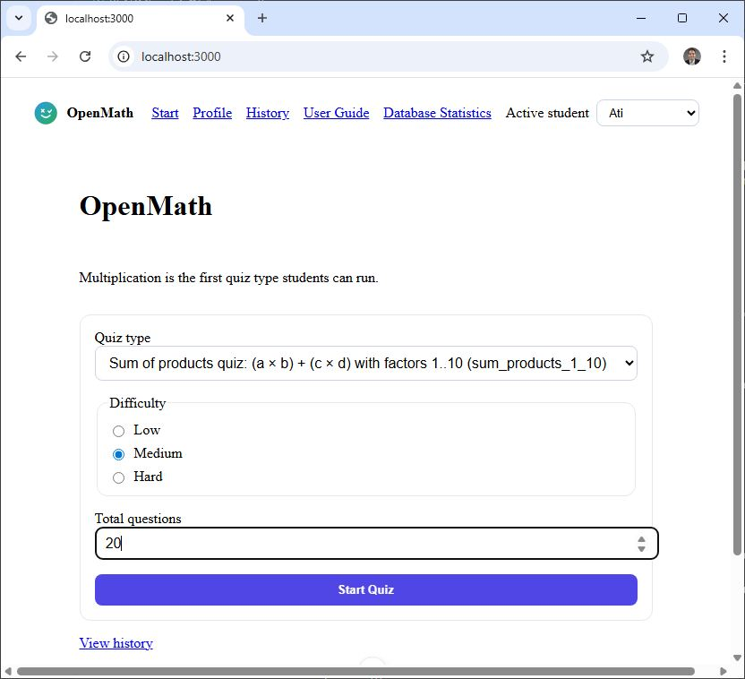
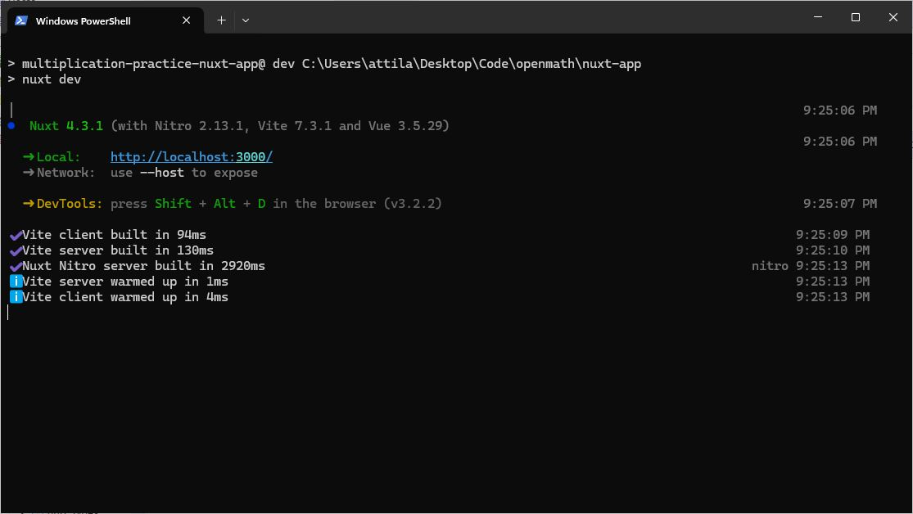
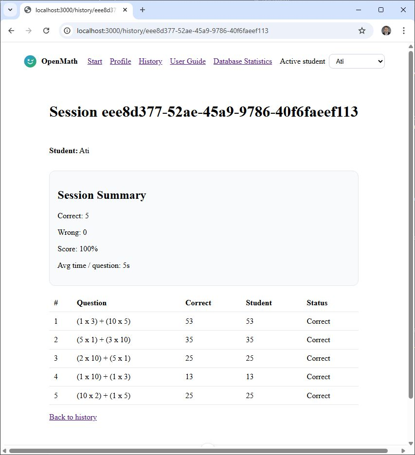
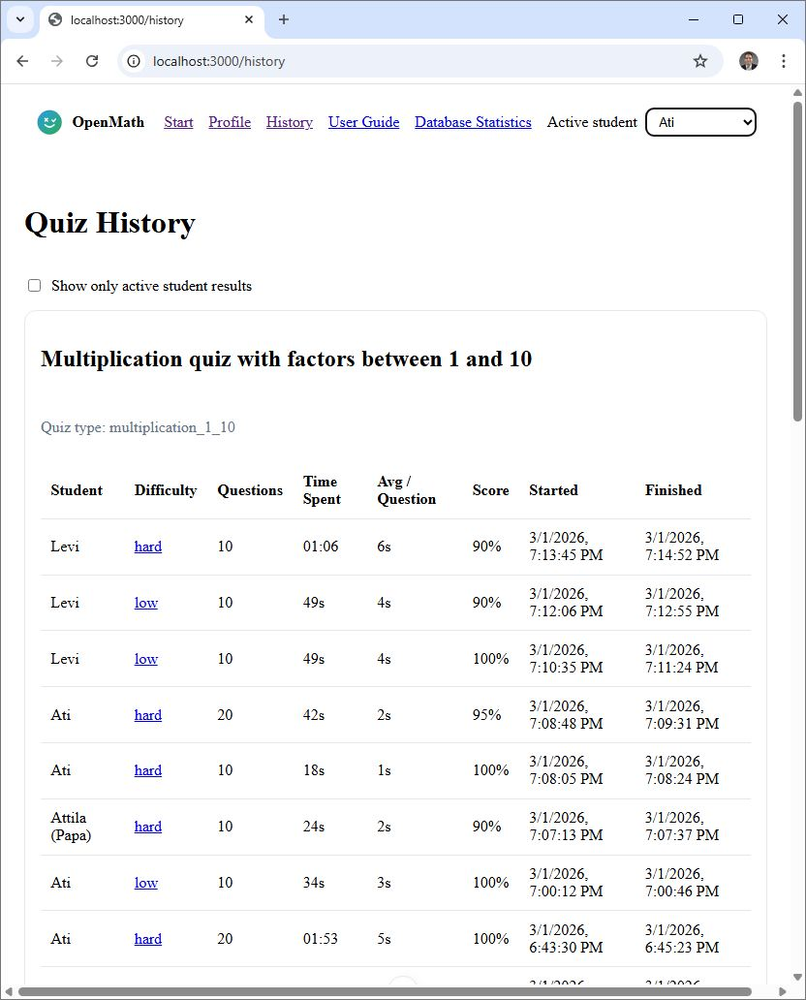
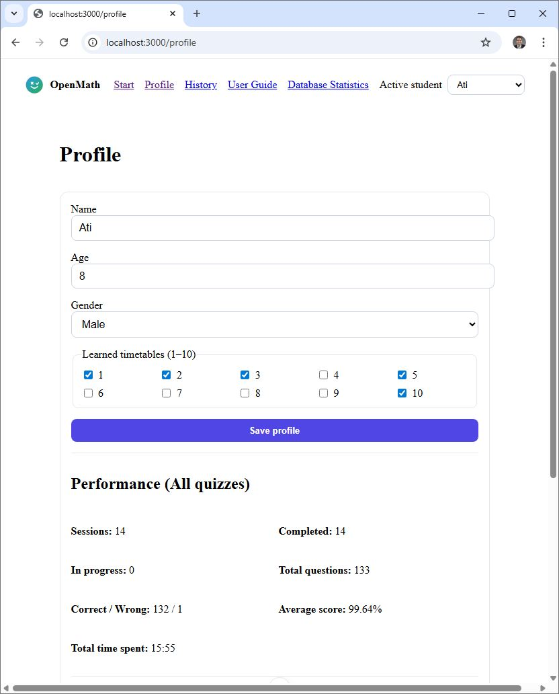
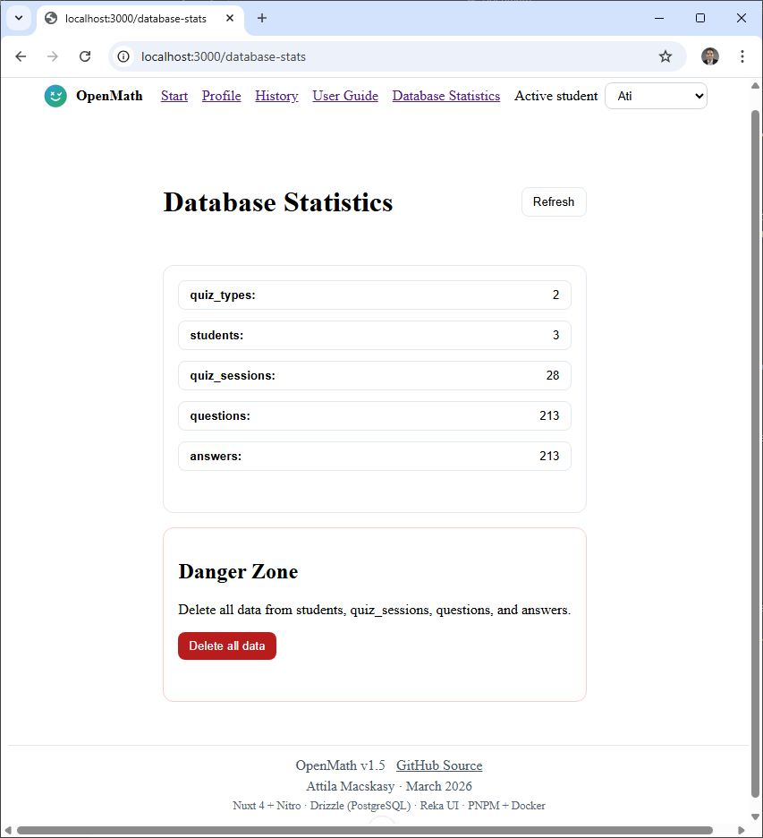
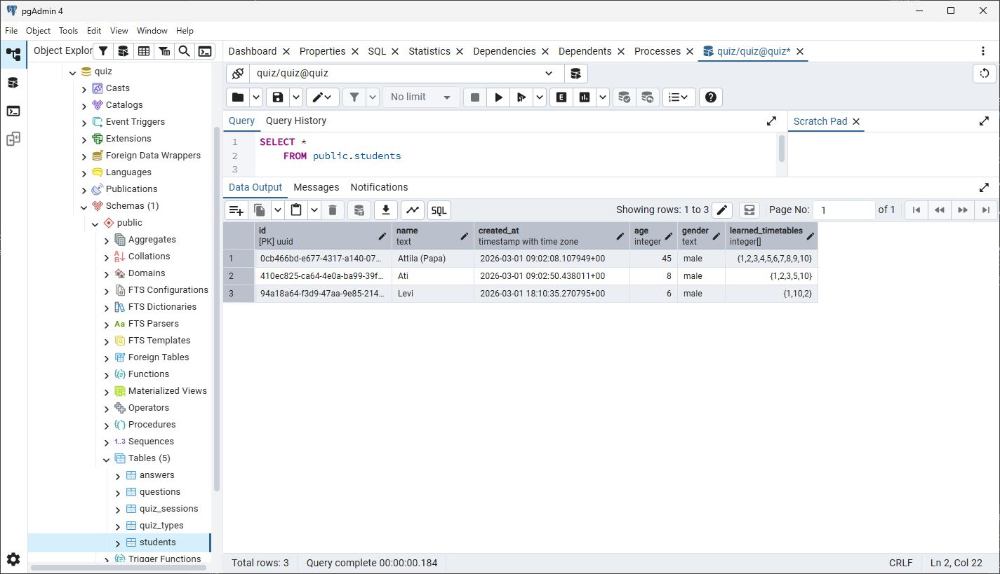
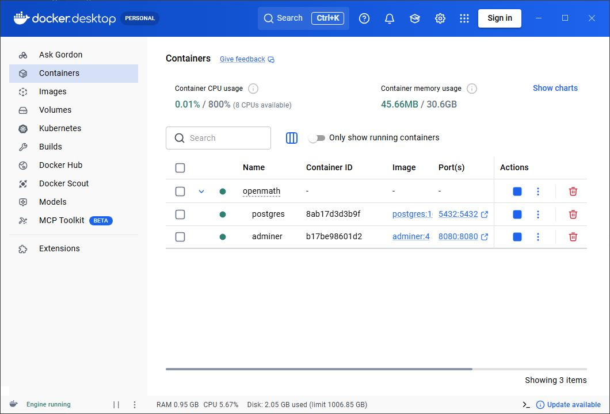
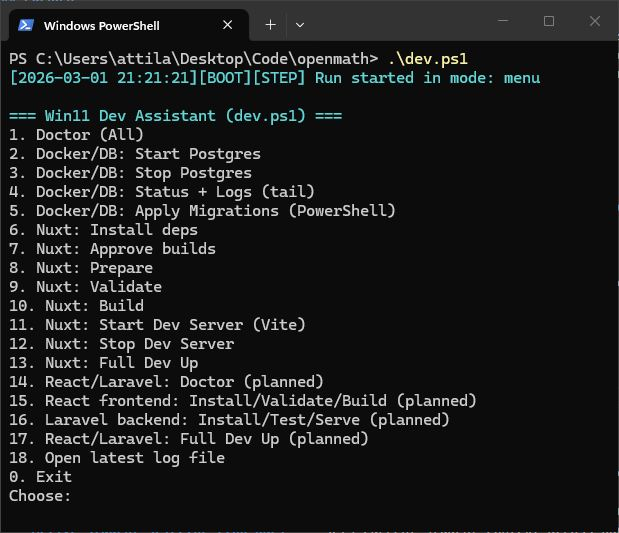

# openmath

<p align="center">
  
</p>

`openmath` is a learning-focused project for building fun, practical math tools for kids, starting with multiplication and expanding into a broader quiz platform.

## Purpose

- Build a child-friendly **OpenMath** quiz platform that improves both correctness and speed.
- Start with multiplication as the first quiz type, then expand with additional quiz formats.
- Keep development spec-driven for consistent implementation and easier iteration.
- Compare multiple stack implementations over the same product domain.

## User Guide (Start Here)

### Objective

The student goal is simple: **get the highest correct score in the least amount of time**.

### Main workflow

1. Select an active student in the top navigation (or keep `No student` to create one when starting).
2. Open **Start**, choose quiz type, difficulty, and question count.
3. Complete the quiz (keyboard-friendly flow with focused answer input).
4. Review results in **History** and session detail.
5. Improve profile and learned timetables in **Profile**, then repeat.

### Menu guide

- **Start** — create and launch a new quiz session.
- **Profile** — edit student preferences and view performance stats.
- **History** — review sessions, resume `In progress` sessions, compare speed/accuracy metrics.
- **User Guide** — usage instructions for students and teachers.
- **Database Statistics** — admin diagnostics: table counts, table row viewer, and danger-zone reset.
- **Active student selector (top bar)** — sets current student context across pages.

## Release Status

- **Nuxt release:** `v1.5` (working)
- **Current primary web app:** `nuxt-app/` (Nuxt 4 + Nitro + Drizzle + PostgreSQL)
- **Python console app:** still available in `python-app/`

## What’s New (Nuxt v1.5)

This section summarizes everything added after `v1.0`.

### 1) Platform and navigation improvements

- Added a global **Active student** selector in the top navigation.
- Student context now persists while navigating pages.
- Added a dedicated **User Guide** page and menu item.
- Rebranded content to OpenMath as a multi-quiz platform (multiplication-first).

### 2) Quiz architecture and content expansion

- Introduced `quiz_types` domain model and DB relationships.
- Added quiz type selection on Start page.
- Added quiz type visibility during quiz and grouped history by quiz type.
- Added new quiz type: `sum_products_1_10` with question pattern `(a x b) + (c x d)`.
- Persisted `c` and `d` terms in questions for full session replay and review.

### 3) Student model and adaptive generation

- Added student profile fields: `age`, `gender`, `learned_timetables` (1..10).
- Generation now respects learned timetables for better personalization.
- Added full profile edit page for active student preferences.

### 4) Quiz UX and flow improvements

- Improved keyboard-only quiz flow with answer input auto-focus between questions.
- Added visual progress bar during quiz.
- Added automatic redirect to session summary after quiz completion.
- Added resume flow from History for unfinished sessions (`In progress` link).
- Resume now starts from first unanswered question and preserves progress correctly.

### 5) History and performance analytics

- History now includes: `Student`, `Questions`, `Time Spent`, `Avg / Question`.
- Added active-student-only filter in History (default ON).
- Session summary now includes average time per question.
- Profile includes aggregated performance metrics:
  - all quizzes combined
  - by quiz type
  - total time spent (overall and by type)

### 6) Database admin and safety tools

- Database Statistics page now supports:
  - per-table record counts
  - row browsing by table
  - refresh actions
- Added **Danger Zone** reset with confirmation phrase `DELETE ALL DATA`.

### 7) Dev tooling and migration workflow

- Added PowerShell migration script and integrated DB migration into `dev.ps1`.
- Added Nuxt start/stop modes in `dev.ps1` with visible server logs.
- Fixed assistant menu exit behavior and script robustness issues.
- Hardened SQL migrations for safer reruns and PostgreSQL compatibility.

## v1.5 Screenshots

### Start page



*OpenMath Start page showing quiz setup with quiz type, difficulty, student selection, and start button.*

### Nuxt / Nitro / Vite / Vue runtime



*Terminal or app runtime view showing Nuxt, Nitro, Vite, and Vue development execution details.*

### Session Summary detail



*Session detail page showing question-by-question results, correctness status, and session summary metrics.*

### Quiz History



*Quiz History page grouped by quiz type with session rows, time spent, average time per question, and status links.*

### Profile page



*Profile page showing active student preferences such as name, age, gender, learned timetables, and performance statistics.*

### Database Statistics



*Database Statistics page showing table record counts, row viewer, refresh controls, and admin data tools.*

### pgAdmin database view



*pgAdmin interface showing OpenMath PostgreSQL schema, tables, and stored quiz data.*

### Docker stack



*Docker environment view showing running services used by OpenMath development stack.*

### Dev assistant script



*PowerShell dev assistant output showing guided commands for Nuxt workflow, validation, build, and migrations.*

## Current Scope (Implemented)

This repository contains two working implementations:

- `python-app/` — multiplication quiz for grade 2 practice (console)
- `nuxt-app/` — full-stack OpenMath app with PostgreSQL persistence

### Python app supports

- Difficulty selection: `low`, `medium`, `hard`
- 10-question quiz flow
- Integer input validation (`Please type a number.` on invalid input)
- Correct/wrong tracking and final percentage score

### Nuxt app supports

- Multi-quiz OpenMath platform (multiplication-first)
- Active student context across pages
- Student profile and learned timetable preferences
- Quiz types, progress tracking, and resumable sessions
- History analytics with speed + accuracy metrics
- Database statistics and admin reset tools

## Planned Scope (Not Yet Implemented Here)

This repo is also designed to host additional full-stack implementations of the same domain:

- `react-laravel/` — React frontend + Laravel backend + PostgreSQL

Target is shared canonical SQL migrations and comparable behavior across stacks.

## Repository Documentation

### Python app docs

- `python-app/README.md`
- `python-app/AI_INSTRUCTIONS.md`
- `python-app/docs/requirements.md`
- `python-app/docs/design.md`
- `python-app/docs/tasks.md`

### Cross-project specs

- `openmath_python_quiz_spec.md` — OpenMath Python console quiz spec (multiplication-first)
- `openmath_nuxt4_drizzle_reka_spec.md` — OpenMath Nuxt full-stack spec + Reka UI spec
- `openmath_react_laravel_chakra_spec.md` — OpenMath React + Laravel + Chakra UI spec
- `multiproject_repo_spec.md` — monorepo strategy and shared DB guidance
- `win11_dev_assistant_nuxt4_spec.md` — Win11 visibility-first assistant spec for Nuxt workflows

## Nuxt Quick Start

From repository root:

```powershell
Set-Location "c:\Users\attila\Desktop\Code\openmath\nuxt-app"
pnpm install
pnpm dev
```

Then open the Nuxt URL shown in terminal (typically `http://localhost:3000`).

## Dev Assistant (Win11)

Use root script `dev.ps1` to run visible, prompt-driven workflows.

### Common modes

```powershell
Set-Location "c:\Users\attila\Desktop\Code\openmath"
.\dev.ps1
.\dev.ps1 doctor
.\dev.ps1 migrate-db
.\dev.ps1 validate-nuxt
.\dev.ps1 build-nuxt
.\dev.ps1 up-nuxt
```

For non-interactive diagnostics:

```powershell
Set-Location "c:\Users\attila\Desktop\Code\openmath"
.\dev.ps1 doctor -AutoApprove
```

### Logs and run artifacts

Each run writes to:

- `.dev-assistant/logs/<timestamp>/run.log`
- `.dev-assistant/logs/<timestamp>/errors.log`
- `.dev-assistant/logs/<timestamp>/summary.json`

## Quick Start (Python App)

Use Python 3 from repository root:

```powershell
Set-Location "c:\Users\attila\Desktop\Code\openmath\python-app"
python src/main.py
```

## License

This project is licensed under the **MIT License**. See `LICENSE`.
