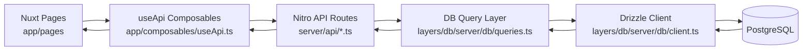
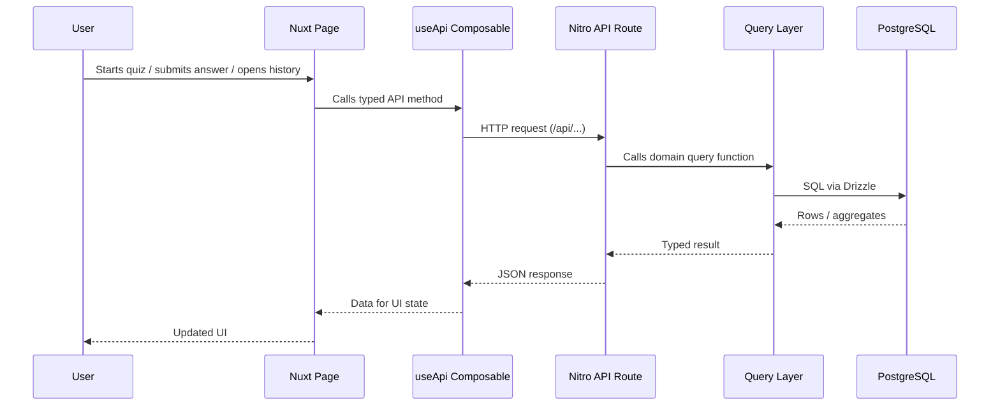

# OpenMath v1.5 Tech Stack and Folder Structure (Nuxt 4)

## 1) Full-Stack Overview

OpenMath is a full-stack learning application built as a Nuxt 4 monorepo with a PostgreSQL database and SQL-first migrations.

At runtime, the flow is:

1. Vue/Nuxt pages call typed composables in `nuxt-app/app/composables`.
2. Composables call Nitro API routes in `nuxt-app/server/api`.
3. API routes call query functions in `nuxt-app/layers/db/server/db/queries.ts`.
4. Queries execute SQL through Drizzle ORM against PostgreSQL.
5. Results flow back through API to the UI.

---

## 2) Core Tech Stack

### Frontend

- **Nuxt 4** (Vue 3 + file-based routing)
- **TypeScript** in pages, composables, and components
- **Reka UI wrappers** in `nuxt-app/layers/ui/reka`
- **State sharing via Nuxt `useState`** (for active student context)

### Backend

- **Nitro server routes** under `nuxt-app/server/api`
- **Zod validation** for request payload validation in API endpoints
- **Layered architecture** (`core`, `db`, `ui`) via Nuxt `extends`

### Data Layer

- **PostgreSQL** as source-of-truth database
- **Drizzle ORM** for schema mapping and typed query building
- **Canonical SQL migrations** in `db/migrations`

### Dev / Ops

- **pnpm** for Nuxt workspace dependencies
- **PowerShell dev assistant** (`dev.ps1`) for guided workflows on Windows
- **Migration scripts**:
  - Bash: `scripts/apply-migrations.sh`
  - PowerShell: `scripts/apply-migrations.ps1`
- **Docker Compose** in repo root (`docker-compose.yml`) for environment support

---

## 3) Data Flow Diagram (Frontend → Backend → DB)



### Request Lifecycle (Sequence)



---

## 4) Repository Structure (Explained)

```text
openmath/
├─ db/
│  ├─ migrations/                  # Canonical SQL migrations (0001..0004)
│  └─ seeds/                       # Optional seed SQL/data
├─ nuxt-app/
│  ├─ app/
│  │  ├─ app.vue                   # Global shell: nav, active student, footer
│  │  ├─ components/               # App-level UI (e.g., OpenMathLogo)
│  │  ├─ composables/useApi.ts     # Typed frontend API client
│  │  └─ pages/                    # File-based routes (start, quiz, history, profile, user-guide)
│  ├─ server/api/                  # Nitro API endpoints
│  ├─ layers/
│  │  ├─ core/                     # Quiz logic (difficulty, generator, scoring)
│  │  ├─ db/                       # Drizzle schema/client/query implementation
│  │  └─ ui/                       # Reusable UI components + Reka wrappers
│  ├─ public/                      # Static assets (logo, etc.)
│  └─ nuxt.config.ts               # Layer composition + runtime config
├─ python-app/                     # Console version of quiz app
├─ scripts/                        # Migration scripts (.sh / .ps1)
├─ dev.ps1                         # Win11 guided dev assistant
└─ docker-compose.yml              # Containerized supporting services
```

### Why this structure works well

- Clear split between **presentation**, **API**, and **data access**.
- Query logic centralized in one file, improving consistency.
- Shared DB migration source for future multi-stack parity.
- Layers keep reusable logic modular (`core`, `db`, `ui`).

---

## 5) Important Configuration Files (and Purpose)

### Root-level configuration

- `package.json` (root)
  - Defines repository-level scripts and shared Node workspace metadata.
- `.env`
  - Stores environment variables such as `DATABASE_URL` used by migrations and runtime.
- `docker-compose.yml`
  - Defines containerized infrastructure (for local service orchestration).
- `dev.ps1`
  - Win11 dev assistant entrypoint; orchestrates doctor/build/validate/migrate and Nuxt runtime flows.
- `scripts/apply-migrations.ps1`
  - PowerShell migration runner for applying ordered SQL files in `db/migrations`.
- `scripts/apply-migrations.sh`
  - Bash migration runner for Linux/macOS shells.

### Nuxt app configuration

- `nuxt-app/nuxt.config.ts`
  - Main Nuxt runtime configuration:
    - layer composition via `extends` (`core`, `db`, `ui`)
    - component auto-import directories
    - runtime config (`databaseUrl`) wiring.
- `nuxt-app/tsconfig.json`
  - TypeScript compiler/project settings for the Nuxt app.
- `nuxt-app/package.json`
  - App-specific dependencies, scripts, and package metadata.
- `nuxt-app/pnpm-workspace.yaml`
  - pnpm workspace wiring for package resolution in the app workspace.
- `nuxt-app/layers/core/nuxt.config.ts`
  - Core layer integration settings for quiz logic and shared conventions.
- `nuxt-app/layers/db/nuxt.config.ts`
  - DB layer registration settings used by the Nuxt app.
- `nuxt-app/layers/ui/nuxt.config.ts`
  - UI layer registration and component exposure settings.

### Database + ORM configuration

- `nuxt-app/layers/db/drizzle.config.ts`
  - Drizzle Kit config (dialect, schema location, output path, db credentials source).
- `nuxt-app/layers/db/server/db/schema.ts`
  - Canonical TypeScript schema mapping to PostgreSQL tables/constraints.
- `db/migrations/*.sql`
  - Canonical ordered SQL migration history (`0001` ... `0004`).

### Practical note

Together, these files create a clean separation of concerns:

- app runtime behavior (`nuxt.config.ts` family)
- environment and deployment wiring (`.env`, Docker, scripts)
- data contract and evolution (`schema.ts` + SQL migrations)

---

## 6) API Surface (Current Nuxt app)

- `POST /api/sessions` — create session and generated questions
- `GET /api/sessions` — history list with quiz/student context
- `GET /api/sessions/:id` — session detail with questions/answers
- `POST /api/answers` — submit answer and update session scoring
- `GET /api/students` — list students
- `GET /api/students/:id` — student profile + performance stats
- `PATCH /api/students/:id` — update student profile/preferences
- `GET /api/quiz-types` — list available quiz types
- `GET /api/stats` — database table counts
- `GET /api/stats/:table` — table row browser
- `POST /api/stats/reset` — destructive reset (confirmation-gated)

---

## 7) Database Design and Migration Strategy

## 7.1 Why SQL-first migrations are a strong choice

Using ordered SQL migrations in `db/migrations` gives:

- **Traceability**: every schema change is versioned and reviewable.
- **Determinism**: environments converge by applying the same scripts.
- **Safety**: additive evolution with backfill/update steps before strict constraints.
- **Portability**: migration source is independent of one framework runtime.

## 7.2 How migrations improved over development

### `0001_init.sql` (foundation)

Established core quiz model:

- `students`
- `quiz_sessions`
- `questions`
- `answers`

Added constraints and indexes for correctness and performance.

### `0002_quiz_types.sql` (domain scaling)

Expanded from single-quiz assumptions to multi-quiz architecture:

- Added `quiz_types` table
- Seeded quiz type records
- Added `quiz_type_id` to sessions/questions/answers
- Backfilled existing records before enforcing NOT NULL
- Added FKs and indexes

This step enabled quiz grouping, filtering, and type-aware analytics.

### `0003_sum_products_quiz_type.sql` (content extension)

Added support for compound question shape `(a × b) + (c × d)`:

- Added optional `c` and `d` columns
- Added range checks for `c` and `d`
- Added idempotent insert for `sum_products_1_10`

This allowed OpenMath to move beyond simple multiplication prompts.

### `0004_student_profiles.sql` (personalization)

Evolved student modeling for adaptive learning:

- Added `age`, `gender`, `learned_timetables`
- Backfilled defaults for existing rows
- Enforced validation checks (age range, allowed genders, timetable constraints)

This unlocked profile-driven question generation and richer analytics.

## 7.3 Migration quality patterns used

- `IF NOT EXISTS` / guarded `DO $$ ... $$` blocks for re-runnability
- Data backfill before `NOT NULL` constraints
- Explicit check constraints to keep invalid data out
- Indexed foreign keys for common query paths

---

## 8) End-to-End Runtime Example (Start Quiz)

1. User opens Start page and chooses quiz type, difficulty, and student context.
2. Page calls `useApi.createSession(...)`.
3. Nitro route validates payload and invokes `createSession(...)` query.
4. Query resolves student + profile context, stores session, and stores generated questions.
5. Response returns `sessionId`, `quizTypeCode`, and question set.
6. Quiz page renders questions and submits answers to `POST /api/answers`.
7. Session scoring updates incrementally; session closes when all questions are answered.
8. History/Profile analytics read from persisted session/question/answer data.

---

## 9) Why this architecture scales

- New quiz types are additive: DB seed + generator logic + UI rendering rules.
- Student personalization is centralized in profile + query layer constraints.
- Analytics are composable because core entities are normalized and indexed.
- Multi-stack future remains viable because migrations stay SQL-canonical.

---

## 10) Practical Commands

From repo root:

```powershell
# Nuxt app
Set-Location "c:\Users\attila\Desktop\Code\openmath\nuxt-app"
pnpm install
pnpm dev

# Apply DB migrations (PowerShell)
Set-Location "c:\Users\attila\Desktop\Code\openmath"
.\scripts\apply-migrations.ps1

# Guided workflow
.\dev.ps1
.\dev.ps1 migrate-db -AutoApprove
```
