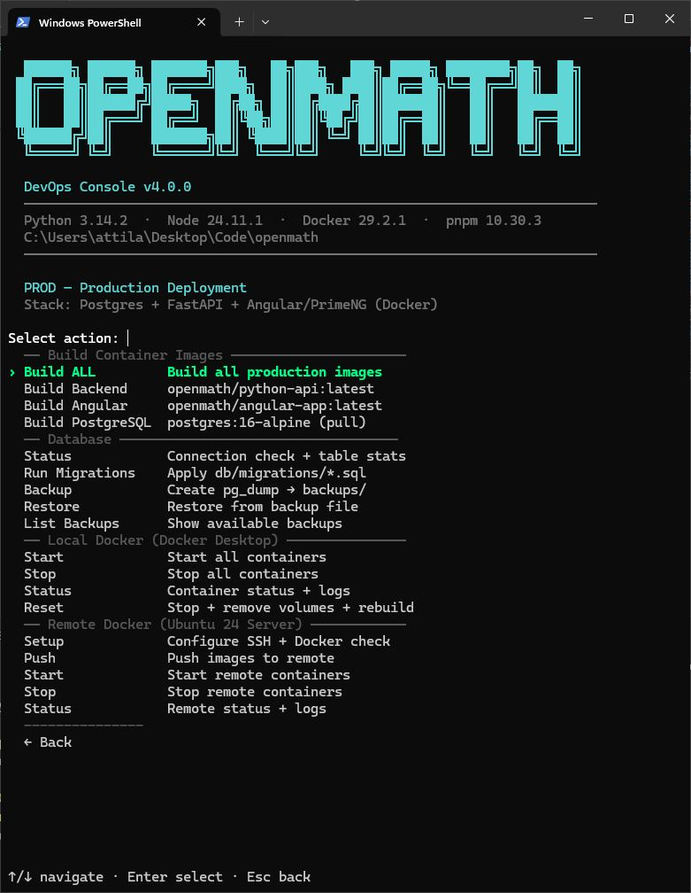
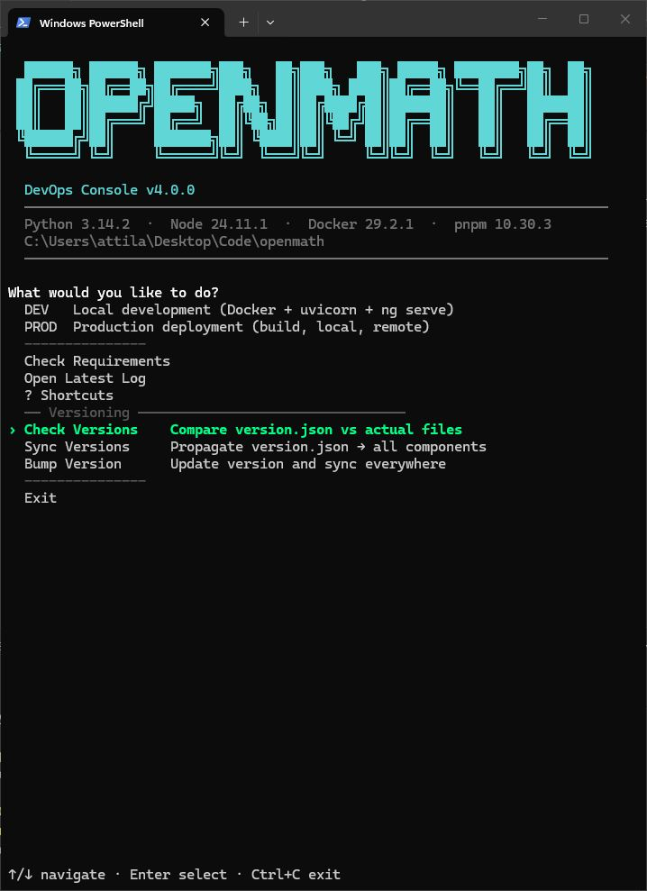
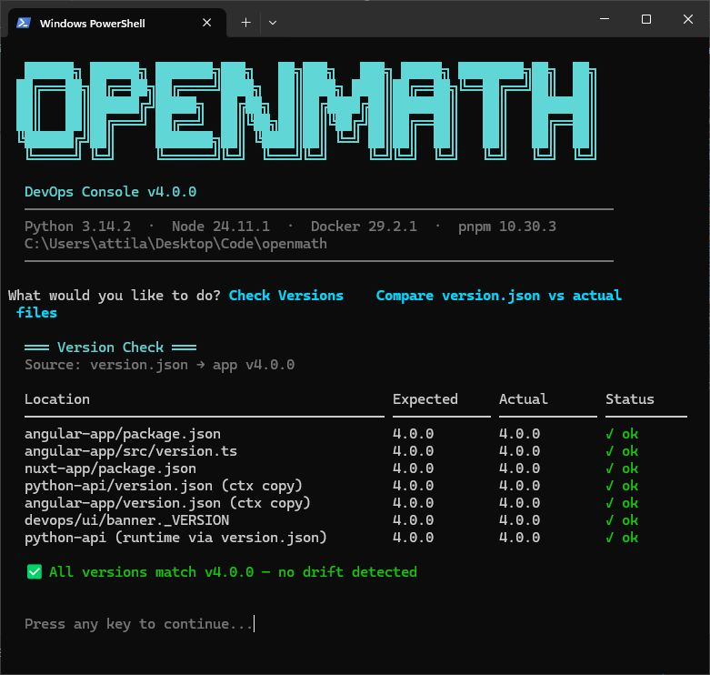
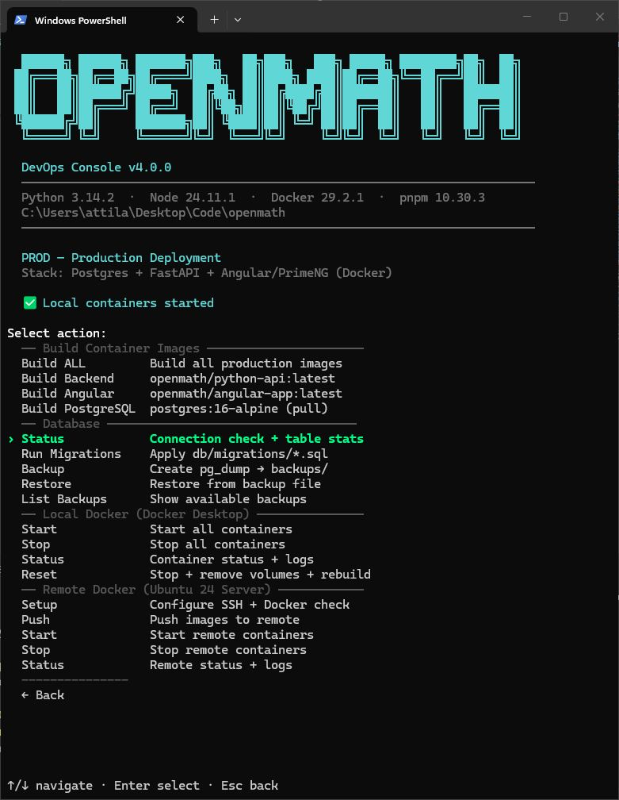
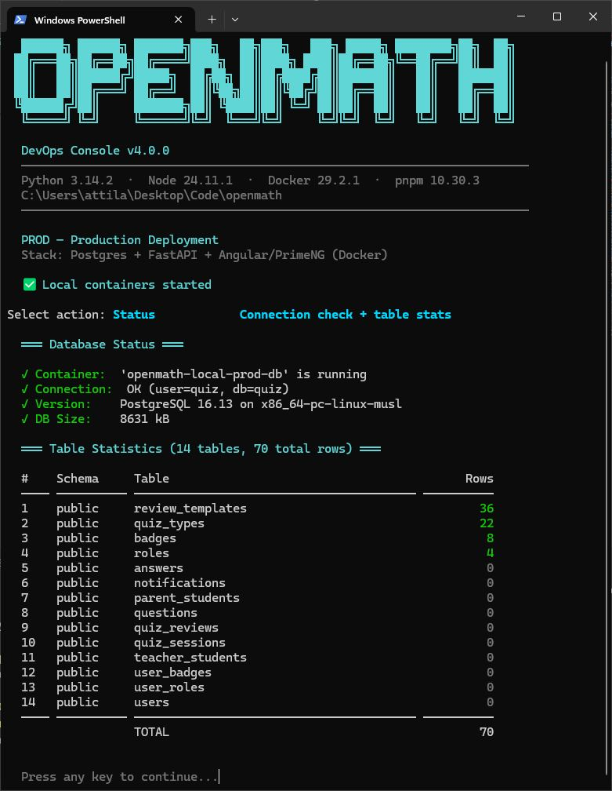
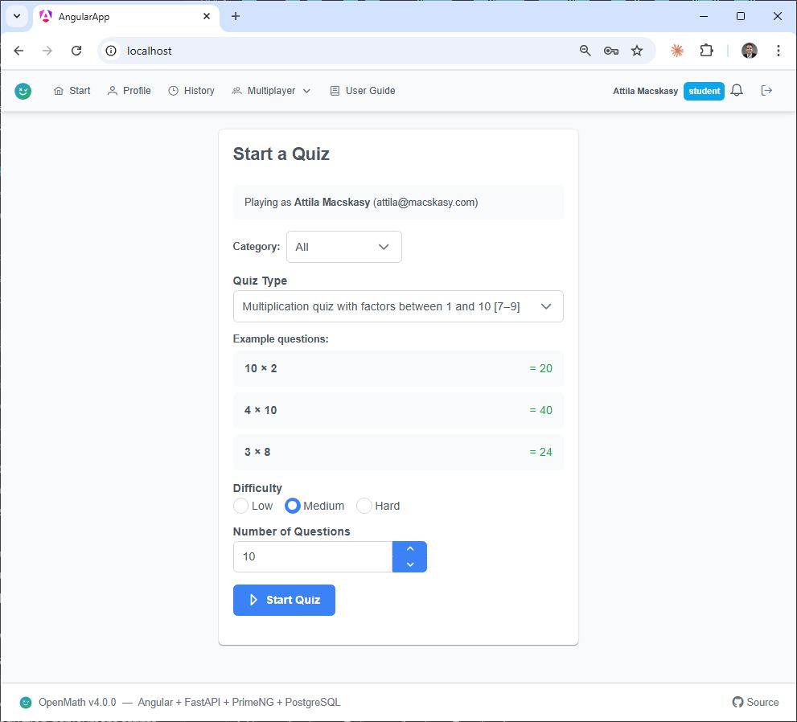
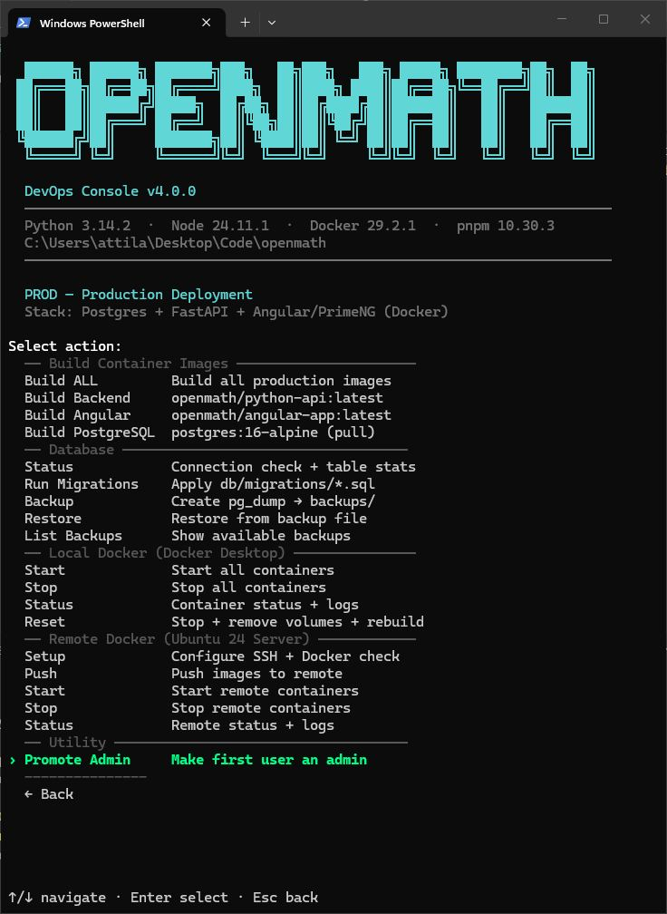
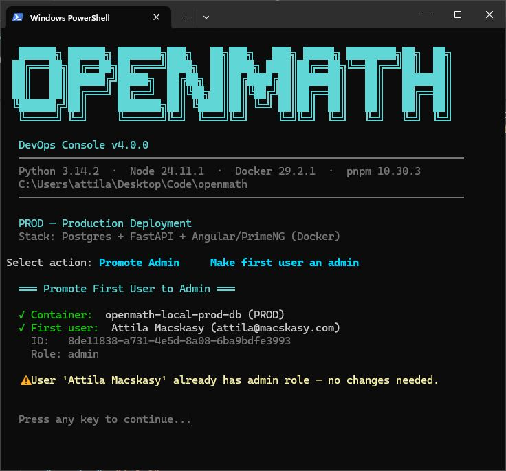

# Implementation Summary — v4.0.0 Centralized Versioning & Database Status

**Date:** 2026-03-15
**Version:** 4.0.0

---

## Overview

All application component versions are now managed from a **single file** at the repository root:

```
version.json          ← single source of truth
```

Previously, versions were scattered across 5+ files with no synchronization.
Changing the application version required manual edits in multiple places and
was prone to drift (e.g., the Angular footer said `v2.6` while the API was at
`v4.0.0`).

Three new DevOps menu items were added to manage versions:

- **Check Versions** — compares `version.json` against actual values in all downstream files
- **Sync Versions** — propagates `version.json` to all components
- **Bump Version** — interactive version change + sync

A new **Database Status** feature was also added to the production menu.

---

## `version.json` Structure

```json
{
  "_comment": "Centralized version config — single source of truth for all components",
  "app": {
    "name": "OpenMath",
    "version": "4.0.0",
    "description": "Multiplayer math quiz platform"
  },
  "components": {
    "angular-app": "4.0.0",
    "python-api": "4.0.0",
    "nuxt-app": "4.0.0",
    "devops": "4.0.0"
  }
}
```

---

## Before / After — Per Component

### 1. DevOps Console (`devops/ui/banner.py`)

| | Details |
|---|---|
| **Before** | Hardcoded `_VERSION = "DevOps Console v3.1"` |
| **After** | `_load_version()` reads `version.json` → `components.devops` at import time |
| **Files changed** | `devops/ui/banner.py` |

### 2. Angular Frontend (`angular-app/`)

| | Details |
|---|---|
| **Before** | `package.json` had `"version": "0.0.0"` (default). Footer version was a hardcoded i18n string `"OpenMath v2.6"` in `en.json` / `hu.json` |
| **After** | `scripts/sync-version.js` reads `../version.json` → writes `src/version.ts` with `APP_VERSION` constant. `FooterComponent` imports `APP_VERSION` and renders it dynamically. Docker build receives version via `ARG APP_VERSION` (set by `builds.py` from `version.json`). Hardcoded `footer.version` i18n key removed |
| **Files changed** | `angular-app/scripts/sync-version.js` (new), `angular-app/src/version.ts` (generated), `angular-app/package.json` (prebuild/prestart scripts, version field), `angular-app/src/app/shared/components/footer/footer.component.ts`, `angular-app/Dockerfile` (ARG), `angular-app/src/assets/i18n/en.json`, `angular-app/src/assets/i18n/hu.json` |

### 3. Python API / FastAPI (`python-api/`)

| | Details |
|---|---|
| **Before** | Hardcoded `version="4.0.0"` in `FastAPI()` constructor in `app/main.py` |
| **After** | `_read_version()` function searches for `version.json` in two locations (Docker: `/app/version.json`, Dev: `../../version.json`) and reads `components.python-api`. `Dockerfile` updated to `COPY version.json` into the image |
| **Files changed** | `python-api/app/main.py`, `python-api/Dockerfile` |

### 4. Nuxt Frontend (`nuxt-app/`)

| | Details |
|---|---|
| **Before** | No version defined anywhere |
| **After** | `nuxt.config.ts` reads `../version.json` via `readFileSync` and exposes it as `runtimeConfig.public.appVersion`. `package.json` includes `"version": "4.0.0"` field |
| **Files changed** | `nuxt-app/nuxt.config.ts`, `nuxt-app/package.json` |

### 5. Docker Production Builds (`devops/prod/builds.py`)

| | Details |
|---|---|
| **Before** | No version injection during builds |
| **After** | `builds.py` reads `version.json`, sets `APP_VERSION` env var for `docker compose build`, and copies `version.json` into sub-project build contexts (`python-api/`, `angular-app/`) before each build |
| **Files changed** | `devops/prod/builds.py`, `docker-compose.prod.yml` (build args for angular-app) |



### 6. Version Sync Menu (`devops/utils/version_sync.py`)

| | Details |
|---|---|
| **Before** | N/A |
| **After** | New menu item in the root DevOps menu: **"Sync Versions"**. Reads `version.json`, updates all downstream files (`package.json` versions, `src/version.ts`, copies into Docker build contexts), and reports status in a table. Also dynamically refreshes the banner version shown in the console |
| **Files changed** | `devops/utils/version_sync.py` (new), `devops/menus/main_menu.py` |

### 7. Check Versions (`devops/utils/version_sync.py`)

| | Details |
|---|---|
| **Before** | N/A |
| **After** | New menu item: **"Check Versions"**. Reads `version.json` and compares the expected version against actual values extracted from every downstream file (package.json fields, version.ts regex, banner string, Docker context copies). Displays a table with Expected / Actual / Status (✓ ok, ✗ mismatch, ⚠ missing) and a summary count of mismatches |
| **CLI** | `python dev.py check-versions` |
| **Files changed** | `devops/utils/version_sync.py`, `devops/menus/main_menu.py`, `devops/cli.py` |





### 8. Bump Version (`devops/utils/version_sync.py`)

| | Details |
|---|---|
| **Before** | N/A |
| **After** | New menu item: **"Bump Version"**. Prompts for a new semver string, validates format, updates `version.json`, then calls `sync_versions()` to propagate everywhere |
| **CLI** | `python dev.py bump-version` |
| **Files changed** | `devops/utils/version_sync.py`, `devops/menus/main_menu.py`, `devops/cli.py` |

### 9. Database Status (`devops/prod/database.py`)

| | Details |
|---|---|
| **Before** | No way to check database health or table statistics from the DevOps CLI |
| **After** | New menu item under **PROD → Databases → Database Status**. Checks container status, PostgreSQL connectivity, database version, total DB size, and displays a full table statistics report with per-table row counts, color-coded (green for populated, dim for empty), sorted by row count descending, with a total row count summary |
| **CLI** | `python dev.py db-status` (dev) / available in PROD menu |
| **Files changed** | `devops/prod/database.py`, `devops/menus/prod_menu.py` |





### 10. Promote First Admin (`devops/utils/promote_admin.py`)

| | Details |
|---|---|
| **Before** | After a clean DB setup and first user registration, there was no admin — you had to manually run SQL to grant the role |
| **After** | New menu item under **DEV → Utility** and **PROD → Utility**: **"Promote Admin"**. Auto-detects which DB container is running (dev or prod), finds the earliest registered user by `created_at`, and grants the `admin` role via the `user_roles` junction table (+ updates the legacy `role` column). Idempotent — safe to re-run. Displays the user's final role list after promotion |
| **CLI** | `python dev.py promote-admin` |
| **Files changed** | `devops/utils/promote_admin.py` (new), `devops/menus/dev_menu.py`, `devops/menus/prod_menu.py`, `devops/cli.py` |

**Workflow:**

1. Start a clean database and apply all migrations
2. Register as a normal local user via the application portal
3. Run **Promote Admin** from the DevOps menu (or `python dev.py promote-admin`)
4. Log back in — you now have full admin access to manage other users







---

## .gitignore

Generated / copied version files are excluded from version control:

```gitignore
python-api/version.json
angular-app/version.json
angular-app/src/version.ts
```

Only the root `version.json` is tracked in Git.

---

## How to Change the Version

1. Edit `version.json` at the repo root
2. Run **DevOps Console → Sync Versions** (or `python dev.py sync-versions`)
3. All components are updated automatically

---

## Architecture Diagram

```
version.json (repo root)
    │
    ├──► devops/ui/banner.py        json.load → _VERSION string
    │
    ├──► angular-app/
    │     ├─ scripts/sync-version.js → src/version.ts (APP_VERSION)
    │     ├─ FooterComponent         imports APP_VERSION
    │     └─ Dockerfile              ARG APP_VERSION (set by builds.py)
    │
    ├──► python-api/
    │     ├─ app/main.py             _read_version() → FastAPI(version=...)
    │     └─ Dockerfile              COPY version.json
    │
    ├──► nuxt-app/
    │     └─ nuxt.config.ts          readFileSync → runtimeConfig.public.appVersion
    │
    └──► devops/prod/builds.py       os.environ["APP_VERSION"] + copy to build contexts
```
