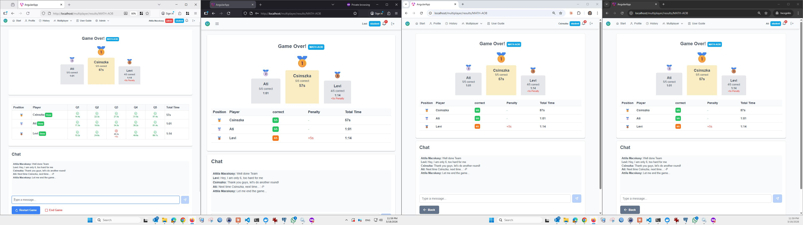
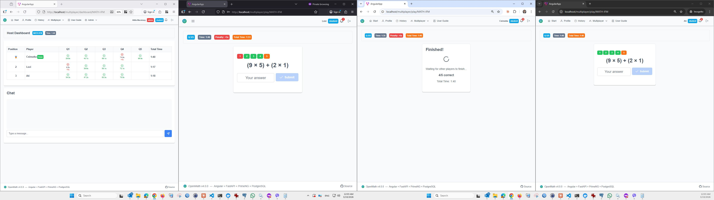
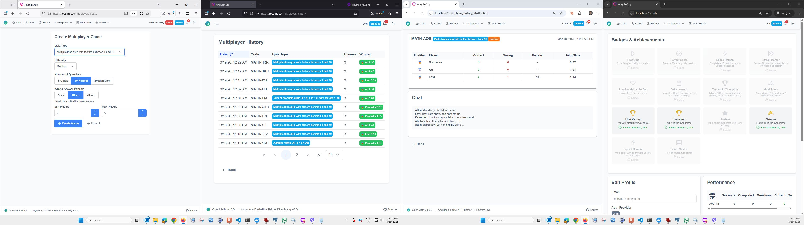
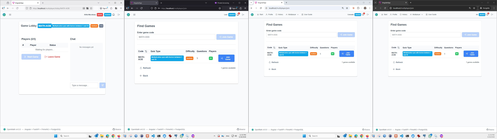
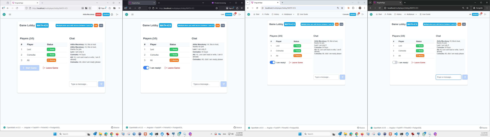
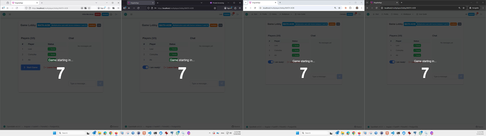

# OpenMath v4.1.0 — Multiplayer LAN Tested & Battle-Ready

**Release Date:** 2026-03-19
**Status:** Tested on LAN with 4 players across 2 PCs — ready for Ati's birthday LAN party!

---

## Summary

v4.1.0 takes the v4.0 multiplayer foundation and hardens it through real-world LAN testing with the family. Every bug discovered during live gameplay was fixed in this session. The result: a fully working, end-to-end multiplayer quiz experience — from lobby to podium — ready for the weekend house party.

---

## What's New

### Post-Game Podium & Results Screen

After all players finish, everyone sees the same podium view with medals, lap times scoreboard, and continued chat.

- Visual podium with medal icons for top 3 players
- Full results summary table (position, correct count, penalty, total time)
- Lap times scoreboard showing per-question performance for all players (correct/wrong icon + time + penalty)
- Chat continues from pre-game lobby into post-game — one continuous conversation
- Host gets **Restart Game** button (creates new game with same settings) and **End Game** button
- Non-host players get **Back** button

### Host Real-Time Dashboard with Lap Times

During gameplay, the host dashboard now shows detailed per-question lap times as answers come in.

- Green check + lap time for correct answers
- Red cross + lap time + penalty for wrong answers
- Real-time position tracking and elapsed timer
- Auto-navigates to results screen when game completes

### Multiplayer Badge System — Fixed & Working

Badges are now properly awarded after each game. Previously, a foreign key constraint bug silently prevented all multiplayer badge awards.

Six multiplayer badges are active:
- **First Victory** — Win your first multiplayer game
- **Champion** — Win 5 multiplayer games
- **Flawless** — Win a game with 100% accuracy
- **Veteran** — Play in 10+ multiplayer games
- **Speed Demon** — Win with all answers under 3 seconds
- **Game Master** — Host 10+ multiplayer games

---

## The Full Game Flow

### 1. Create & Join

Host creates a game, players join with the game code.

### 2. Lobby & Chat

Players chat, toggle ready. Host starts when all ready. Chat persists through the entire game session.

### 3. Countdown & Play

3-2-1 countdown overlay, then players race through questions. Host watches the live dashboard.

### 4. Results & Restart

Podium, scoreboard, chat. Host can restart with same settings or end the game.

---

## Bugs Fixed in This Release

### Critical

| Bug | Root Cause | Fix |
|-----|-----------|-----|
| **WebSocket player isolation** — Player on PC2 couldn't see players on PC1 | 2 uvicorn workers = 2 separate in-memory GameManagers | Changed Dockerfile to `--workers 1` |
| **Multiplayer badges never awarded** | `award_badge()` passed `game_id` as `session_id`, but FK constraint references `quiz_sessions` table. Silent `except: return None` swallowed the error | Pass `None` for `session_id` on multiplayer badges; added proper error logging |
| **Badge rule field mismatch** | Badge rules use `"count"` key but code read `"threshold"` | Fixed to `rule.get("count", rule.get("threshold", ...))` |

### UI/UX

| Bug | Fix |
|-----|-----|
| Lap times not shown on host dashboard | Added lap time display below correct/wrong icons for every answer |
| No post-game results screen | Created `GameResultsComponent` with podium, scoreboard, chat, and host controls |
| Post-game chat showed empty ":" lines | Normalized DB field names (`user_name`/`message`/`sent_at`) to WS format (`sender`/`text`/`time`) |
| `formatLapTime` returned empty for falsy values | Changed `!ms` check to `ms == null` |
| Host dashboard didn't navigate to results | Added auto-navigation to `/multiplayer/results/:code` on `game_completed` |
| Players navigated back to lobby after game | Changed quiz `game_completed` handler to navigate to results screen |

### Infrastructure

| Change | Details |
|--------|---------|
| CORS for LAN | Added LAN IP to `CORS_ORIGINS` in `.env.prod` |
| PostgreSQL port exposed | Added `5433:5432` port mapping for pgAdmin access during development |
| Dev-only warning | Created `docs/NOTE_dev_db_port.md` to remind removing DB port + LAN CORS before production |

---

## Files Changed

### New Files
- `angular-app/src/app/features/multiplayer/game-results.component.ts` — Post-game podium, scoreboard, chat, restart
- `docs/release_v4.1.0_multiplayer_tested.md` — This release note
- `docs/NOTE_dev_db_port.md` — Dev-only infrastructure warning
- `assets/images/v4.1.0_multiplayer_tested/` — LAN test screenshots

### Modified Files
- `angular-app/src/app/app.routes.ts` — Added `/multiplayer/results/:code` route
- `angular-app/src/app/core/services/multiplayer-ws.service.ts` — Added `lastGameCompleted` signal cache
- `angular-app/src/app/features/multiplayer/host-dashboard.component.ts` — Lap times display + results navigation
- `angular-app/src/app/features/multiplayer/multiplayer-quiz.component.ts` — Navigate to results on game complete
- `angular-app/src/assets/i18n/en.json` — Added `multiplayer.results.*` i18n keys
- `angular-app/src/assets/i18n/hu.json` — Added `multiplayer.results.*` i18n keys
- `python-api/app/services/badges.py` — Fixed FK constraint bug, field name mismatch, added logging
- `python-api/app/services/multiplayer.py` — Added badge evaluation logging
- `python-api/Dockerfile` — Single worker for WebSocket consistency

---

## Test Environment

- **Host PC:** Windows 11, Docker Desktop, 3 browser sessions (Chrome, Chrome Incognito, Firefox)
- **Remote PC:** Windows, Chrome browser over LAN (172.22.20.x)
- **Players:** Attila Macskasy (host), Ati (8), Csinszka (9), Levi (6)
- **Games played:** 14 games across multiple quiz types and difficulties
- **Docker stack:** PostgreSQL 16 + FastAPI/uvicorn (1 worker) + Angular 18/nginx

---

## Ready for the Weekend

All systems go for Ati's birthday LAN party! The multiplayer quiz system has been battle-tested with the family and every discovered issue has been resolved. Players can:

- Create and join games with a simple code
- Chat before, during (host), and after the game
- Race through math questions with real-time position tracking
- See a visual podium with lap times after each game
- Earn badges for wins, streaks, and milestones
- Host can restart games instantly with the same settings

Happy birthday Ati! May the fastest mathematician win! 🎂🥇
