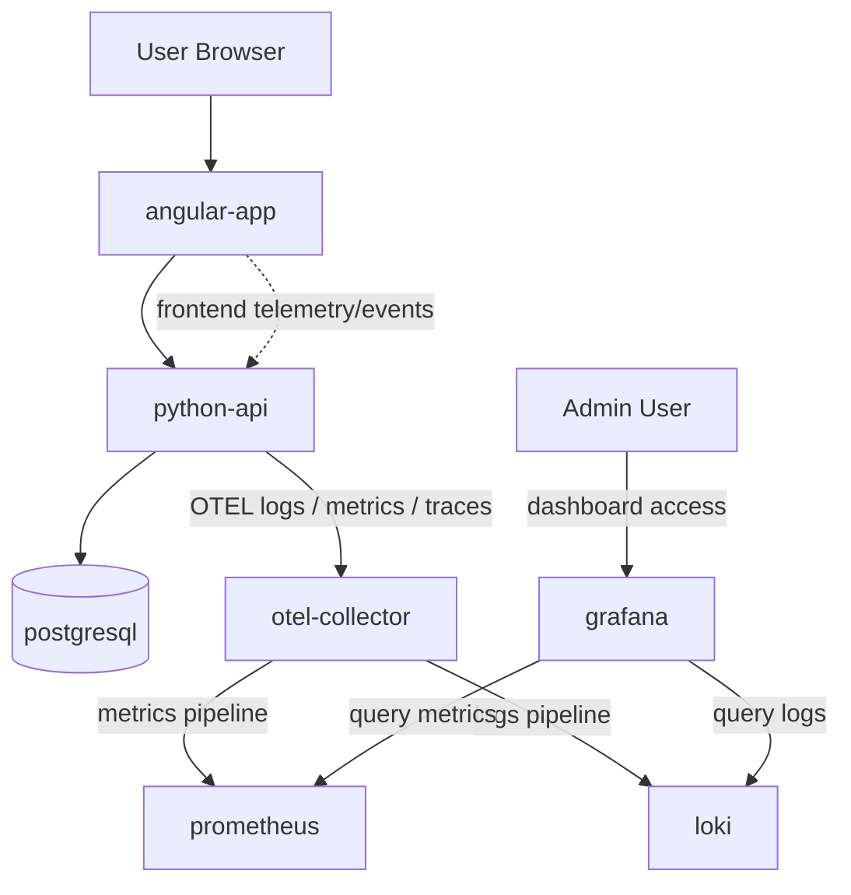

# OpenMath Specification
## OpenTelemetry Monitoring Stack for Real-Time Observability

**Version:** n/a
**Status:** Draft Specification  
**Date:** 2026-03-14  
**Module:** Observability / Monitoring / Telemetry / Operations

---

# 1. Overview

This specification defines a self-hosted observability and real-time monitoring stack for OpenMath using **OpenTelemetry (OTEL)** and a Docker-deployed monitoring platform.

The goal is to give administrators operational visibility into:

- who is currently logged in
- active user sessions
- what users are doing inside the application
- backend activity and request flows
- application errors and failures
- performance metrics
- operational statistics
- real-time dashboards for admins and operators

This monitoring stack is intended to be **self-hosted** and deployed as part of the OpenMath Docker environment.

---

# 2. Goals

Primary objectives:

1. Standardize OpenTelemetry-based telemetry output from OpenMath services
2. Collect structured OTEL-format logs from application containers
3. Collect metrics and traces for real-time operational visibility
4. Provide self-hosted dashboards for admins
5. Support live monitoring of logged-in users and active sessions
6. Support historical analysis of usage and system behavior
7. Integrate with the existing Docker-based self-hosted deployment model
8. Keep the design portable for future cloud environments

---

# 3. Scope

Included in this version:

- OTEL-format structured application logs
- OpenTelemetry Collector container
- Prometheus container
- Grafana container
- Loki container
- telemetry flow from application to storage and dashboards
- real-time observability dashboards
- active user/session visibility requirements
- monitoring architecture for self-hosted Docker deployments

Not included in this version:

- enterprise SIEM integration
- long-term cold storage
- alerting escalation tools like PagerDuty
- distributed tracing across external third-party services
- centralized multi-cluster observability
- audit compliance retention policy design

---

# 4. Why OpenTelemetry

OpenTelemetry becomes the standard telemetry format and instrumentation model for OpenMath.

Benefits:

- vendor-neutral telemetry standard
- structured logs
- standardized traces and metrics
- flexible routing through collector pipeline
- easier future portability to cloud observability platforms
- clear separation between instrumentation and storage/visualization

OpenMath should emit telemetry in OTEL-compatible format from backend services and, where practical, from frontend session analytics pipelines.

---

# 5. Monitoring Use Cases

The monitoring system must help admins understand real-time system behavior.

## 5.1 Real-Time Visibility

Admins should be able to see:

- currently logged-in users
- currently active sessions
- active student quiz sessions
- teacher review activity
- parent portal activity
- recent logins and logouts
- currently active API request volume
- errors happening now

## 5.2 Behavioral Visibility

Admins should be able to understand:

- which pages or workflows users are using
- quiz start/completion events
- review workflow activity
- badge/certificate generation activity
- session export activity
- failed authentication attempts
- heavy usage periods
- drop-off points in user flows

## 5.3 Operational Visibility

Operators should be able to monitor:

- API latency
- request throughput
- database error trends
- container health
- CPU and memory pressure
- log error rates
- slow endpoints
- storage growth risk

---

# 6. High-Level Architecture

The observability stack extends the existing OpenMath production deployment with additional monitoring containers.

Baseline application containers already present:

1. `postgresql`
2. `python-api`
3. `angular-app`

Additional observability containers introduced by this spec:

4. `otel-collector`
5. `prometheus`
6. `loki`
7. `grafana`

Optional future containers may include:

- alertmanager
- tempo
- node-exporter
- cadvisor

Those optional components are out of scope for the baseline v2.9 requirement.

---

# 7. Additional Containers Required

## 7.1 otel-collector

### Purpose

Acts as the telemetry intake and routing layer.

### Responsibilities

- receive OTEL logs, metrics, and traces from application services
- process/enrich telemetry
- export logs to Loki
- export metrics to Prometheus-compatible pipeline
- optionally export traces to future tracing backend
- provide a central and consistent telemetry routing layer

### Why required

Without the collector, each app would need custom output logic for every backend. The collector reduces complexity and standardizes telemetry flow.

---

## 7.2 prometheus

### Purpose

Stores and queries time-series metrics.

### Responsibilities

- scrape metrics endpoints
- store application and collector metrics
- support Grafana dashboards
- support historical and near-real-time metrics analysis

### Example metrics

- request count
- response times
- active sessions count
- quiz completion rate
- login rate
- failed login count
- container/service health metrics

---

## 7.3 loki

### Purpose

Stores and queries structured logs.

### Responsibilities

- store application logs
- store OTEL-derived logs routed from collector
- support filtering by user, endpoint, session, role, severity, event type
- support Grafana log dashboards and investigations

### Example log searches

- all failed logins in the last hour
- quiz completion events by user
- badge award events
- export PDF failures
- API errors by endpoint

---

## 7.4 grafana

### Purpose

Provides the visualization and dashboard layer.

### Responsibilities

- visualize Prometheus metrics
- visualize Loki logs
- show real-time admin dashboards
- provide drill-down from dashboard panels into logs
- support operational and usage analytics dashboards

### Example dashboard categories

- system health dashboard
- active users dashboard
- login/session dashboard
- quiz activity dashboard
- errors dashboard
- admin operations dashboard

---

# 8. Architecture Diagram



---

# 9. Telemetry Data Flow

This section explains how OTEL data flows from application activity to final dashboards.

## 9.1 Application Activity

A user action occurs inside OpenMath, for example:

- login
- logout
- open quiz
- answer question
- complete session
- teacher review submission
- parent sign-off
- PDF export
- certificate generation

## 9.2 Instrumented Event Creation

The application creates telemetry for that action.

Examples:

- structured application log event
- counter metric increment
- histogram timing
- trace span for request/operation

## 9.3 OTEL Export

The backend sends telemetry to `otel-collector`.

Typical internal endpoint:

```text
http://otel-collector:4317
```

or

```text
http://otel-collector:4318
```

depending on gRPC or HTTP OTLP configuration.

## 9.4 Collector Processing

The collector:

- receives telemetry
- validates structure
- enriches resource metadata
- attaches service labels such as:
  - service name
  - environment
  - container name
  - deployment version
- routes logs to Loki
- routes metrics toward Prometheus-compatible consumption
- preserves traces for future expansion

## 9.5 Storage and Query

- **Loki** stores logs
- **Prometheus** stores time-series metrics

## 9.6 Dashboard Rendering

Grafana queries Loki and Prometheus and renders dashboards for admins in real time.

---

# 10. Required Telemetry Types

OpenMath must emit three observability signal types where feasible:

1. logs
2. metrics
3. traces

---

# 11. OTEL Logs Requirements

## 11.1 Structured Log Format

Application logs must be structured and machine-queryable.

Each log entry should include, where available:

- timestamp
- severity
- service name
- environment
- container name
- request id
- trace id
- span id
- user id
- session id
- role
- endpoint
- event type
- result status
- duration
- message

## 11.2 Example Event Types

Examples of log event names:

- `auth.login.success`
- `auth.login.failure`
- `auth.logout`
- `session.started`
- `session.completed`
- `quiz.question.answered`
- `review.marked`
- `parent.signed`
- `badge.awarded`
- `certificate.generated`
- `session.pdf.exported`
- `api.request.completed`
- `api.request.failed`

## 11.3 Privacy Requirements

Logs must avoid storing sensitive data such as:

- raw passwords
- tokens
- full personal secrets
- unnecessary personal profile data

Student activity telemetry must be operationally useful without exposing restricted personal data unnecessarily.

---

# 12. Metrics Requirements

Metrics should capture both technical and business-operational behavior.

## 12.1 Technical Metrics

Examples:

- API requests per minute
- average request latency
- p95 request latency
- HTTP error rate
- DB connection failures
- background job duration
- container restarts
- health status

## 12.2 Operational / Product Metrics

Examples:

- currently logged-in users count
- active sessions count
- quizzes started per minute
- quizzes completed per minute
- average quiz score
- badge awards per day
- certificate generations per day
- PDF exports per day
- teacher review actions per day
- parent sign-offs per day

## 12.3 Session Activity Metrics

To support the admin need to understand real-time user activity, the system must expose metrics such as:

- active authenticated users
- active student quiz sessions
- active teacher review sessions
- active parent portal sessions
- last activity age per session cohort
- concurrent users by role

---

# 13. Trace Requirements

Tracing is required primarily for backend request flow visibility.

Traces should help diagnose:

- slow API requests
- DB-heavy operations
- login bottlenecks
- certificate generation bottlenecks
- PDF export slowness
- complex user workflow latency

Minimum tracing scope:

- incoming API requests
- DB query groups or transaction blocks where practical
- major business operations

Future tracing expansion may include frontend-to-backend distributed tracing, but this is not mandatory for baseline v2.9.

---

# 14. How to Track Logged-In Users and Active Sessions

This is a key requirement.

## 14.1 Logged-In Users

“Currently logged in” should be defined operationally as:

- authenticated user has a valid active session or token
- session is not expired
- last-seen heartbeat/activity remains within configured active window

Recommended active window example:

```text
last activity within 5 minutes = active
```

## 14.2 Session Activity Model

The application should generate telemetry when:

- session created
- session refreshed
- page activity heartbeat received
- user performs meaningful action
- session expired
- logout occurs

## 14.3 Recommended Session Events

- `user.session.created`
- `user.session.active`
- `user.session.expired`
- `user.session.closed`
- `user.heartbeat`
- `user.page.view`
- `user.action`

## 14.4 Recommended Supporting Data Fields

- user id
- role
- login time
- last activity time
- client type
- session id
- page/feature name
- tenant/school identifier if multi-tenant in future

## 14.5 Dashboard Outcome

Grafana dashboards should be able to show:

- currently active users
- active users by role
- recent login timeline
- session count trend
- top active features
- current quizzes in progress

---

# 15. Application Instrumentation Requirements

## 15.1 Python API

The Python backend must be the primary OTEL instrumentation source.

It must emit:

- structured OTEL logs
- request metrics
- endpoint timing
- auth events
- session lifecycle events
- business events

### Example instrumented backend operations

- login request
- logout request
- token validation
- quiz start
- answer submission
- quiz completion
- leaderboard query
- badge evaluation
- certificate generation
- PDF export
- teacher review update

---

## 15.2 Angular Frontend

The frontend should contribute session activity visibility through one of these methods:

1. emit activity/heartbeat events to backend, which backend converts into telemetry
2. optionally emit frontend telemetry directly in future versions

Baseline v2.9 recommendation:

- frontend sends activity and page usage events to backend APIs
- backend records and emits OTEL telemetry centrally

This keeps initial architecture simpler and more controllable for self-hosted deployment.

---

# 16. Docker Networking

All monitoring components must run on the same internal Docker network as the application stack or on a dedicated connected observability network.

Recommended network options:

## Option A: Single shared network

```text
openmath-local-prod-net
```

All app and monitoring containers join the same network.

## Option B: Split network later

- `openmath_app_net`
- `openmath_obs_net`

Baseline recommendation for self-hosted simplicity:

- use one shared internal Docker network first

---

# 17. Container Exposure Rules

## Publicly reachable by default

- `angular-app`
- `grafana` (admin-restricted access)

## Internal only by default

- `python-api`
- `postgresql`
- `otel-collector`
- `prometheus`
- `loki`

Notes:

- Grafana should be protected with authentication
- Prometheus, Loki, and Collector should not be publicly exposed by default
- Database remains private as in v2.8

---

# 18. Suggested Internal Endpoints

Examples of internal service endpoints:

## OTEL Collector

```text
otel-collector:4317
otel-collector:4318
```

## Prometheus

```text
http://prometheus:9090
```

## Loki

```text
http://loki:3100
```

## Grafana

```text
http://grafana:3000
```

## Python API

```text
http://python-api:8000
```

## PostgreSQL

```text
postgresql:5432
```

---

# 19. Dashboard Requirements

Grafana must provide dashboards that are useful for administrators, not only infrastructure operators.

## 19.1 Dashboard 1 — System Overview

Should display:

- API request rate
- error rate
- average latency
- service health
- container status
- database availability

## 19.2 Dashboard 2 — Active Users

Should display:

- current logged-in users count
- current active sessions count
- active users by role
- logins over time
- recent logouts
- top active pages/features

## 19.3 Dashboard 3 — Quiz Operations

Should display:

- quizzes started now
- quizzes completed now
- average score trend
- quiz duration trend
- most used quiz type
- difficulty distribution

## 19.4 Dashboard 4 — Admin / Teacher Activity

Should display:

- teacher review actions
- parent sign-offs
- session PDF exports
- certificate generations
- badge award frequency

## 19.5 Dashboard 5 — Errors and Investigations

Should display:

- latest errors
- top failing endpoints
- auth failures
- export failures
- log drill-down panels from Loki

---

# 20. Log Query Requirements

Loki queries should support filtering by dimensions such as:

- service
- environment
- event type
- severity
- user id
- role
- session id
- endpoint
- request id

This makes it possible to answer questions such as:

- Which users are active right now?
- Which endpoint is failing most often?
- Who exported a session PDF in the last 30 minutes?
- Which teacher reviewed sessions today?
- What happened before a certificate generation error?

---

# 21. Prometheus Data Sources

Prometheus should collect metrics from one or more of the following:

- Python API metrics endpoint
- OTEL Collector exported metrics endpoint
- optional container/runtime exporters in later versions

Baseline required scrape targets:

- `python-api`
- `otel-collector`
- `prometheus` self-monitoring

Optional later:

- postgres exporter
- node exporter
- cadvisor

---

# 22. Retention Expectations

Baseline retention should be configurable.

Recommended starting point for self-hosted installations:

- Prometheus metrics retention: 15 to 30 days
- Loki logs retention: 7 to 14 days

Final retention depends on:

- host storage capacity
- traffic volume
- privacy rules
- operational needs

---

# 23. Security and Privacy

Observability must help operations without becoming a privacy risk.

Requirements:

- no secrets in logs
- no raw passwords or tokens
- role-based access to Grafana dashboards
- Grafana admin account must be protected
- internal services not exposed publicly
- session telemetry should use identifiers carefully
- sensitive user content should not be logged unnecessarily

Optional privacy improvement:

- pseudonymize user identifiers in some dashboards while preserving drill-down capability for authorized admins

---

# 24. Docker Deployment Impact

This spec adds new monitoring containers to the self-hosted Docker deployment.

## 24.1 Existing v2.8 containers

1. `postgresql`
2. `python-api`
3. `angular-app`

## 24.2 New v2.9 containers

4. `otel-collector`
5. `prometheus`
6. `loki`
7. `grafana`

This expands the stack from **3 containers** to **7 containers** for the monitored deployment profile.

---

# 25. Recommended Repository Additions

Suggested files:

```text
deploy/otel/otel-collector-config.yaml
deploy/monitoring/prometheus.yml
deploy/monitoring/loki-config.yml
deploy/monitoring/grafana-provisioning/
deploy/docker-compose.monitoring.yml
docs/specs/v2.9-otel-monitoring.md
```

Optional later additions:

```text
deploy/monitoring/dashboards/
deploy/monitoring/alerts/
```

---

# 26. Example Data Flow Summary

Example: student completes a quiz

1. Student submits final answer in frontend
2. Frontend calls backend API
3. Backend completes quiz session processing
4. Backend writes structured OTEL log:
   - `session.completed`
5. Backend increments metrics:
   - quizzes completed counter
   - score histogram
   - active session adjustments
6. Backend emits trace span for completion workflow
7. Telemetry is exported to `otel-collector`
8. Collector routes logs to Loki
9. Collector exposes/forwards metrics to Prometheus pipeline
10. Grafana dashboards update
11. Admin sees real-time increase in:
    - completed quizzes
    - current active session changes
    - recent activity logs

---

# 27. Acceptance Criteria

This spec is considered implemented when all of the following are true:

1. OpenMath emits OTEL-compatible structured telemetry from the backend
2. Application logs are queryable in Loki
3. Metrics are visible in Prometheus
4. Grafana dashboards visualize both operational and product usage data
5. Admins can see currently logged-in users through dashboarded session metrics/logs
6. Admins can see active sessions and user activity trends
7. Monitoring runs self-hosted in Docker as part of the deployment
8. OTEL Collector is used as the telemetry ingestion and routing layer
9. Prometheus, Loki, and Grafana are integrated into the stack
10. Internal telemetry services are not publicly exposed by default

---

# 28. Future Enhancements

Potential next improvements:

- Tempo for trace storage
- alerting rules and Alertmanager
- node-exporter and cadvisor
- DB-specific exporter
- SSO for Grafana
- tenant-aware dashboards
- anomaly detection dashboards
- long-term archive strategy
- audit event streams
- per-school analytics views

---

# 29. Summary

Version 2.9 adds a self-hosted observability stack to OpenMath using OpenTelemetry, OTEL Collector, Prometheus, Loki, and Grafana.

It enables administrators to understand in real time:

- who is logged in
- which sessions are active
- what users are doing
- how the application is performing
- where errors are happening
- how usage patterns evolve over time

This design extends the Docker-based OpenMath deployment with a practical and modern monitoring foundation while remaining portable for future infrastructure evolution.
